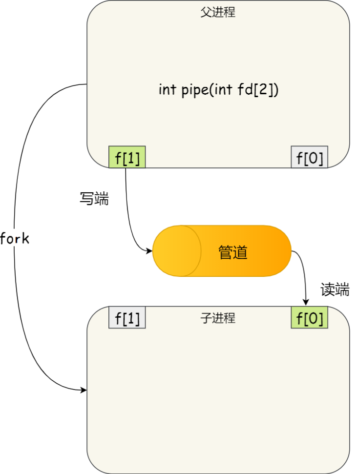
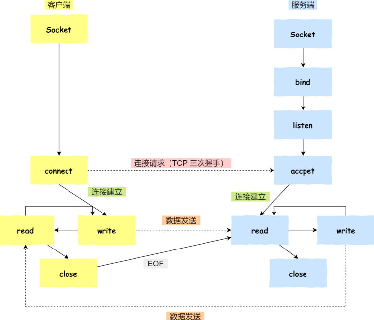
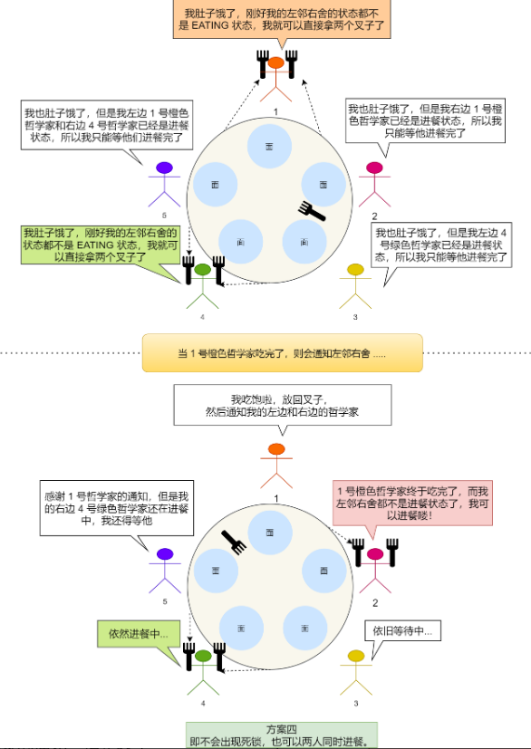
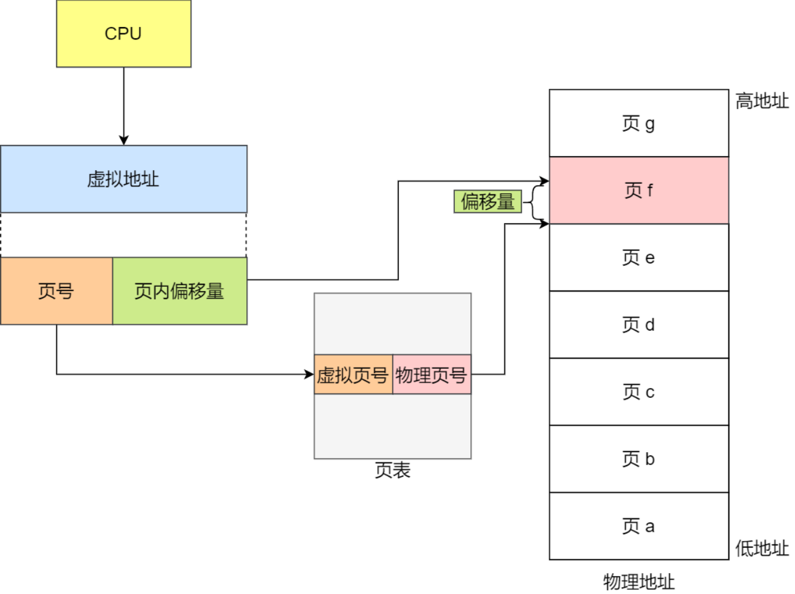

<!--
 * @Author: yao fanghao
 * @Date: 2023-04-14 22:13:52
 * @LastEditTime: 2023-06-06 17:02:50
 * @LastEditors: yao fanghao
-->

# 参考资料

* **CSAPP**
* **操作系统导论OSTEP** √
* **APUE**
* https://stevens.netmeister.org/631/
* 软件调试
* 王道-操作系统 √
* 操作系统真象还原
* 小林coding-图解系统 √
* https://xiaolincoding.com/
* 嵌入式软件开发笔试面试指南
* Linux是怎样工作的 √
* [2020 南京大学 “操作系统：设计与实现” (蒋炎岩)](https://www.bilibili.com/video/BV1N741177F5 )
* [【清华 操作系统原理】](https://www.bilibili.com/video/BV1uW411f72n)
* [【【哈工大】操作系统 李治军（全32讲）】](https://www.bilibili.com/video/BV19r4y1b7Aw/)
* [【彻底搞懂 进程&线程、进程池&线程池】](https://www.bilibili.com/video/BV1V84y1Y77s/)

# 操作系统概念

* 特点
  * 并发
  * 共享
  * 虚拟
  * 异步

* Linux
  * 多任务、SMP对称多处理、ELF可执行文件、宏内核
* Windows
  * NT、PE可执行文件、混合型内核

# 进程与线程

## -进程

* 进程的状态
  * 运行台 就绪态 阻塞态（等待态） 创建态 终止态
  *   
  
* 进程控制块 PCB
  * **PCB 是进程存在的唯一标志**

* 并发：交替进行
* 并行：同时进行 --流水线

## -线程

* 线程间可以并发运行且共享相同的地址空间
* 进程中一个线程崩溃，其他线程都崩溃
* **线程是调度的基本单位，进程是资源拥有的基本单位**

* 线程的实现
  * 用户线程的整个线程管理和调度，操作系统不直接参与
  * 用户级线程库函数来完成线程的管理，包括线程的创建、终止、同步和调度等
  * 内核线程由操作系统管理程对应的TCB放在操作系统
  * 内核线程的创建、终止和管理都由操作系统负责
  * 轻量级线程 LWP

## -进程调度算法

* **需要考虑的因素**
  * CPU利用率
  * 吞吐量。长作业会降低吞吐量
  * 周转时间。进程运行和阻塞时间的总和
  * 等待时间。进程处于就绪队列的时间
  * 响应时间。交互式系统中衡量调度算法的主要标准

* FCFS 先来先服务调度算法
  * 不可剥夺
  * 效率低，适用于CPU繁忙型作业
  * 对长作业有利，对短作业不利
  
* SJF 短作业优先调度算法
  * 对短作业有利
  * 相比FCFS降低了平均周转时间
  * 可能会导致长作业“饥饿”现象
  
* 优先级调度算法
  * 分为非抢占式和抢占式
  * 优先级设置规则：
    * 系统进程>用户进程 交互型>非交互型 I/O型>计算型
  
* RR 时间片轮转调度算法
  * 适用于分时系统，提高交互体验
  * 选择适当的时间片很重要
  
* MLFQ **多级反馈队列调度算法**
  *  
  * 动态调整优先级和时间片大小
  * **多个就绪队列，每个队列不同优先级**
  * **每个队列进程运行时间片不同**
  * **每个队列采用FCFS算法**
  * **按队列优先级调度**
  * 优点：短作业优先，周转时间短，长作业不会饿死

## -协程

* 是一种比线程更加轻量级的存在
* 正如一个进程可以拥有多个线程一样，一个线程也可以拥有多个协程
* 协程不被操作系统内核所管理，而是**完全由程序所控制**（也就是在用户态执行）
* 协程的优点是性能得到了很大的提升，不像线程切换那样消耗资源

# 进程间通信 IPC

## -管道

* 管道是内核中的一串缓存，无格式且大小受限
* 一次性操作，只支持半双工
* 生产者消费者模式

* 匿名管道。Linux命令行中的 "|"
  * **只能用于父子关系的进程间通信**
* 命名管道。**FIFO**
  
  ```shell
  mkfifo myPipe
  echo "hello" > myPipe
  cat < myPipe
  ```
  
  

## -消息队列

* 消息队列是内核中的消息链表
* 不适合大数据传输

## -共享内存

* 共享内存的机制是拿出一块虚拟地址空间，映射到相同的物理内存中
  
## -信号量

* 信号量是一个整型的计数器
* 用于实现进程间的**互斥与同步**
* **P、V 操作**
  * P操作使得信号量减1
  * V操作使得信号量加1

## -信号

* 可参考APUE第10章
* 唯一的异步通信机制
* 两种无法捕捉和忽略的信号：SIGKILL、SEGSTOP

## -Socket

```c
int socket(int domain, int type, int protocal) 
```

* 字节流SOCKSTREAM、数据包SOCKDGRAM

* 基于TCP协议的通信示例：
  

* 1.服务端和客户端初始化socket，得到文件描述符
* 2.服务端调用bind，绑定IP和端口
* 3.服务端调用listen，开始监听
* 4.服务端调用accept，等待客户端连接
* 5.客户端调用connect，向服务端IP和端口发起连接请求
* 6.服务端调用accept，返回用于传输的socket文件描述符
* 7.客户端调用write写入数据
* 8.服务端调用read读取数据
* 9.客户端断开连接时，调用close，那么服务端read读取数据的时候，会读到EOF，待处理完数据后，服务端调用 close，表示连接关闭
* 这里需要注意的是，服务端调用 accept 时，连接成功了会返回一个已完成连接的 socket，后续用来传输数据。

# 多线程同步

* 多个线程如果竞争共享资源，如果不采取有效的措施，则会造成共享数据的混乱
* 竞争条件。不确定性
* **临界区**

## -互斥与同步

* 同步举例：「操作 A 应在操作 B 之前执行」，「操作 C 必须在操作 A 和操作 B 都完成之后才能执行」等
* 互斥举例：「操作 A 和操作 B 不能在同一时刻执行」

* **锁**
  * 原子操作指令 —— 测试和置位（Test-and-Set）
  
  ```c
  int TestAndSet(int *old_ptr, int new)
  {
    int old = *old_ptr;
    *old_ptr = new;
    return old;
  }
  ```

  * **忙等待锁**。也称为自旋锁
  * 无等待锁。

* **信号量**
  
  * P/V操作
  
  ```c
  // 信号量数据结构
  type struct sem_t{
    int sem;  // 资源个数
    queue_t *q;  // 等待队列
  } sem_t;

  // 初始化信号量
  void init(sem_t *s, int sem)
  {
    s->sem = sem;
    queue_init(s->q);
  }

  // P操作
  void P(sem_t *s)
  {
    s->sem--;
    if(s->sem < 0)
    {
      // 1、保留调用线程CPU现场
      // 2、将该线程的TCB插入s的等待队列
      // 3、设置该线程为等待状态
      // 4、执行调度程序
    }
  }
      
  // V操作
  void V(sem_t *s)
  {
    s->sem++;
    if(s->sem <= 0)
    {
      // 1、移除s等待队列首元素
      // 2、将该线程的TCB插入就绪队列
      // 3、设置该线程为就绪状态
    }
  }
  ```

  * 对于两个并发线程，互斥信号量的值仅取 1、0 和 -1 三个值
  * **如果互斥信号量为 1，表示没有线程进入临界区**
  * **如果互斥信号量为 0，表示有一个线程进入临界区**
  * **如果互斥信号量为 -1，表示一个线程进入临界区，另一个线程等待进入**
  * 通过互斥信号量的方式，能保证临界区任何时刻只有一个线程在执行，就达到了互斥的效果。

## -生产者-消费者问题

* 问题描述：
  * 生产者在生成数据后，放在一个缓冲区中
  * 消费者从缓冲区取出数据处理
  * 任何时刻，只能有一个生产者或消费者可以访问缓冲区

* 互斥与同步的体现：
  * 任何时刻只能有一个线程操作缓冲区，操作缓冲区是临界代码，说明需要互斥
  * 缓冲区空时，消费者必须等待生产者生成数据；缓冲区满时，生产者必须等待消费者取出数据。说明需要同步

* 需要三个信号量：
  * **互斥信号量 mutex**：用于互斥访问缓冲区，初始化值为 1
  * **资源信号量 fullBuffers**：用于消费者询问缓冲区是否有数据，有数据则读取数据，初始化值为 0（表明缓冲区一开始为空）；
  * **资源信号量 emptyBuffers**：用于生产者询问缓冲区是否有空位，有空位则生成数据，初始化值为 n （缓冲区大小）

  ```c
  semaphore mutex = 1;
  semaphore empty = n;  // 空闲缓冲区大小
  semaphore full = 0;   // 缓冲区初始为空
  producer()
  {
    while(1)
    {
      生产数据...
      P(empty);
      P(mutex);
      把数据放入缓冲区...
      V(mutex);
      V(full);      
    }
  }
  consumer()
  {
    while(1)
    {
      P(full);
      P(mutex);
      从缓冲区中取出数据...
      V(mutex);
      V(empty);
      消费数据...      
    }
  }

  ```

## -哲学家就餐问题

* 用一个数组 state 来记录每一位哲学家在进程、思考还是饥饿状态（正在试图拿叉子）
* <https://leetcode.cn/problems/the-dining-philosophers/description/>


## -读写者问题

* ...

# 锁

## -死锁

* 死锁产生需**同时**满足的四个条件
  * **互斥**
    
  * **不剥夺**
    
  * **请求并保持**
    
  * **循环等待**
    

* ```pstack <pid>``` 显示每个线程的栈跟踪信息（函数调用过程）

## -避免死锁

* 破坏四个条件之一即可
* 使用资源有序分配法，破坏环路等待条件
* 死锁避免算法：银行家算法

## -锁的种类

* 加锁的目的是保证共享资源在任意时间里，只有一个线程访问，避免多线程导致共享数据错乱的问题

* 互斥锁 [独占锁]
  * 加锁失败后，线程会释放CPU
  * 
* 自旋锁
  * 加锁失败后，线程会忙等待
  * 相对来说开销比互斥锁小一点
* 读写锁
  * 适用于读多写少的场景
  * 
  * 公平读写锁，防止饥饿问题
* 悲观锁
  * 悲观锁认为多线程同时修改共享资源的概率比较高，于是很容易出现冲突，所以访问共享资源前先要上锁
* 乐观锁
  * 如果多线程同时修改共享资源的概率比较低，就可以采用乐观锁
  * 乐观锁假定冲突的概率很低
  * 乐观锁的工作方式：
    * 先修改完共享资源，再验证这段时间内有没有发生冲突
    * 如果没有其他线程在修改资源，操作完成
    * 如果发现有其他线程已经修改过这个资源，放弃本次操作
  * 乐观锁的应用：在线文档多人编辑、Git、SVN

# 内存管理

## -虚拟内存

* 不同进程的虚拟地址和不同内存的物理地址映射
* 虚拟地址（VA）---> **内存管理单元（MMU）** ---> [映射到]物理地址（PA）

* 管理方式：内存分段和**内存分页**
* 内存分段：
  * 段表：段号、段基地址、段界限
  * 问题：内存碎片、交换效率低
* 内存分页
  * 把整个虚拟和物理内存空间分为若干页
  * 每一页4kb
  * 换出换入 swap out / swap in
  * 
  * **页表**：页号、页内偏移
  * 多级页表
    * 解决页表过大的问题
  * **TLB**-Translation Lookaside Buffer
    * 页表缓存，局部性原理
* **段页式内存管理**
  * 段号、段内页号和页内位移
  * 第一次访问段表，得到页表起始地址；
  * 第二次访问页表，得到物理页号；
  * 第三次将物理页号与页内位移组合，得到物理地址。
  * 

## -Linux内存管理

* 

* 程序文件段 .text
  * 包括二进制可执行代码
* 已初始化数据段 .data
  * 包括静态常量
* 未初始化数据段 .bss
  * 包括未初始化的静态变量
* 堆段
  * 包括动态分配的内存，从低地址开始向上增长
* 文件映射段
  * 包括动态库、共享内存等，从低地址开始向上增长（跟硬件和内核版本有关）
* 栈段
  * 包括局部变量和函数调用的上下文等
* 堆和文件映射段的内存动态分配
  * 比如使用C标准库的 malloc() 或 mmap() ，就可以分别在堆和文件映射段动态分配内存。

## -页面置换算法

* OPT 最佳置换算法
  * 无法实现，但作为评价基准
  
* FIFO 先进先出页面置换算法
  * Belady异常

* **LRU 最近最久未使用置换算法**
  * 最新访问放在第一位
  * 缓存满了删除末尾（最不经常访问的数据）

## -磁盘调度算法

* FCFS 先来先服务算法
  
* SSF 最短寻道时间优先
  * 优先选择从当前磁头位置所需寻道时间最短的请求
  * 可能产生饥饿：磁头在一小块区域来回移动

* SCAN 扫描算法（电梯算法）
  * 磁头在一个方向上移动，访问所有未完成的请求
  * 直到磁头到达该方向上的最后的磁道，才调换方向
  * 

* C-SCAN 循环扫描算法
  * 有磁头朝某个特定方向移动时，才处理磁道访问请求
  * 返回时直接快速移动至最靠边缘的磁道，也就是复位磁头，并且返回中途不处理任何请求
  * 

* LOOK与C-LOOK算法
  * SCAN的优化：LOOK。磁头在移动到「最远的请求」位置，然后立即反向移动
  * C-SCAN的优化：C-LOOK。反向移动途中不响应请求

# 文件系统

## -组成

* 一切皆文件
* 
* Linux文件系统组成：
  * 索引节点 inode
    * 记录文件的元信息，如 inode 编号、文件大小、访问权限、创建时间、修改时间、数据在磁盘的位置等等
    * **索引节点是文件的唯一标识**
  * 目录项 dentry
    * 记录文件的名字、索引节点指针以及与其他目录项的层级关联关系

* 磁盘读写最小单位是**扇区** 512B
* 文件系统把多个扇区组成了逻辑块
* Linux中逻辑块大小为4KB，也就是8个扇区

## -虚拟文件系统 VFS

* Linux支持的文件系统分为三类：
  * 磁盘文件系统。占用磁盘空间。如Ext 2/3/4
  * 内存文件系统。占用内存空间。如/proc /sys
  * 网络文件系统。如NFS、SMB

## 文件的使用

* 文件描述符 fd
* 系统调用。```open(); write(); close();```
* **打开文件表**中维护打开文件的状态和信息：
  * 文件指针
  * 文件打开计数器
  * 文件磁盘位置
  * 访问权限

## -文件存储

* 连续空间存放
  * 指定起始块位置和长度
  * 缺点：磁盘空间碎片、文件长度不易扩展
  
* 非连续空间存放方式
  * **链表方式**或**索引方式**
  * 「隐式链表」：文件头要包含「第一块」和「最后一块」的位置，并且每个数据块里面留出一个指针空间，用来存放下一个数据块的位置
  * 「显式链接」：把用于链接文件各数据块的指针，显式地存放在内存的一张链接表中，该表在整个磁盘仅设置一张，每个表项中存放链接指针，指向下一个数据块号
    * 文件分配表 FAT
  * 「索引数据块」：里面存放了指向文件数据块的指针列表（相当于书的目录）
    * 没有碎片问题
    * 方便创建、扩大、缩小
    * 支持顺序读写和随机读写
  * 「链式索引块」：链表加索引的组合
    * 在索引数据块留出一个存放下一个索引数据块的指针
    * 
  * 「多级索引块」

## -空闲空间管理

* 空闲表法
* 空闲链表法
  * 
* 位图法

## -软链接和硬链接

* 硬链接
  * 只有删除文件所有硬链接及源文件时，系统才会彻底删除该文件

* 软链接
  * 跨文件系统
  * 相当于重新创建文件，有独立的inode
  * 该文件的内容是另外一个文件的路径

## -文件I/O

* 直接与非直接 I/O
* 阻塞与非阻塞 I/O
  * I/O 多路复用技术。如```select poll```
* 同步与异步 I/O

# 设备管理

* 输入输出设备可分为两大类：
  * 块设备（Block Device）
  * 字符设备（Character Device）

* 中断有两种:
  * **软中断**，例如代码调用 INT 指令触发
  * **硬件中断**，硬件通过中断控制器触发的

* DMA
  * 设备在 CPU 不参与的情况下，能够自行完成把设备 I/O 数据放入到内存
  * 

* 设备驱动程序

* 存储系统I/O软件分层
  * 文件系统层、通用块层、设备层
  * 