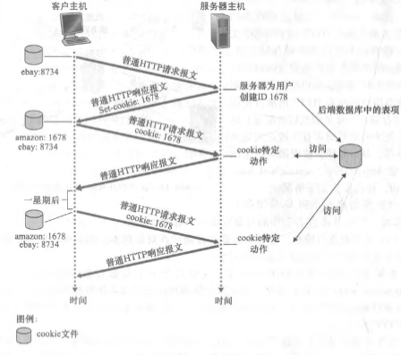
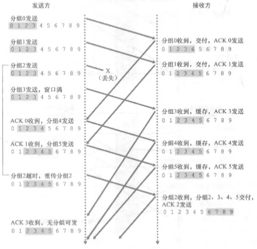
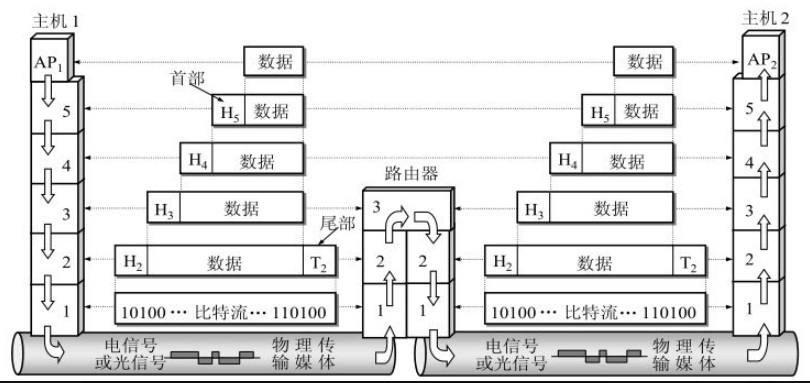
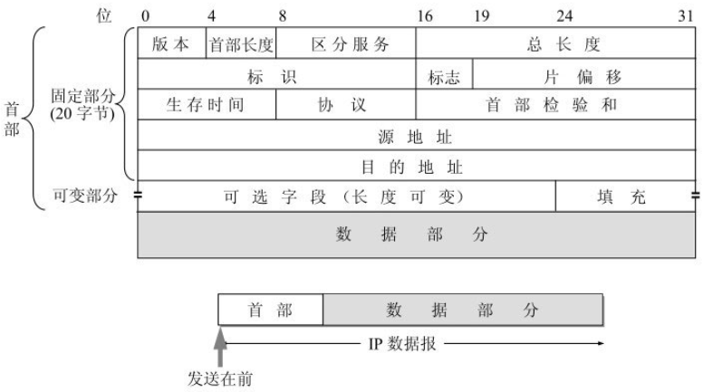
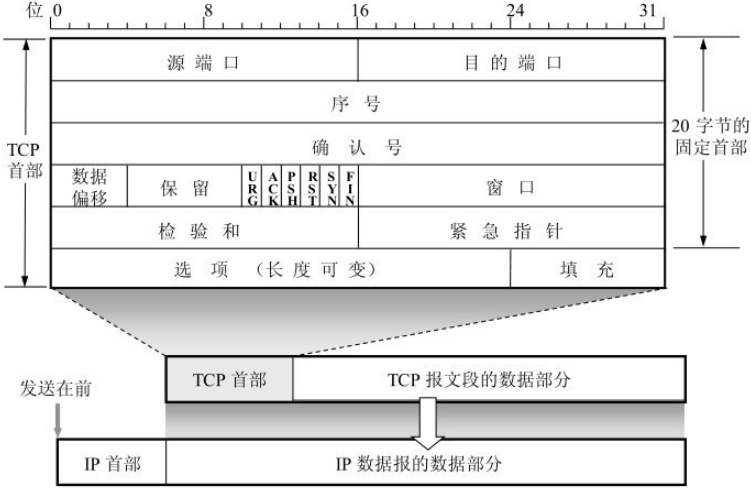
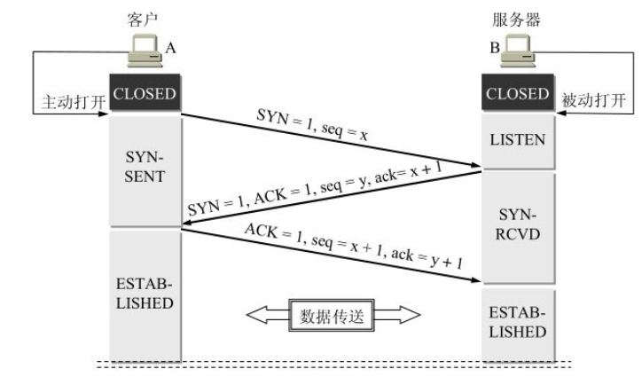
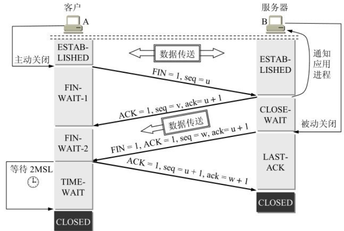
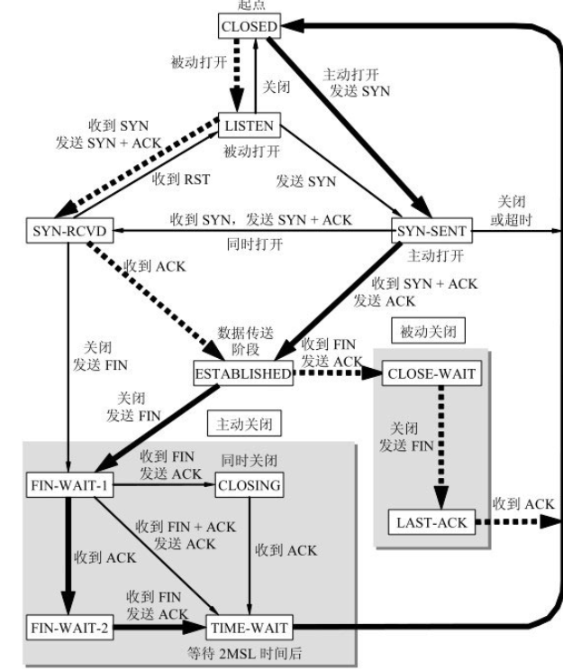

<!--
 * @Author: yao fanghao
 * @Date: 2023-04-14 22:13:53
 * @LastEditTime: 2023-06-01 16:14:13
 * @LastEditors: yao fanghao
-->

# 参考资料

* **计算机网络-自顶向下方法**
* **计算机网络-谢希仁** √
* **UNP**
* 王道-计算机网络 √
* 网络是怎样连接的 √
* 图解TCP/IP √
* 嵌入式软件开发笔试面试指南
* 【中科大郑烇、杨坚全套《计算机网络（自顶向下方法 第7版，James F.Kurose，Keith W.Ross）》课程】 <https://www.bilibili.com/video/BV1JV411t7ow/>
* 【史上最强最细腻的linux嵌入式C语言学习教程【李慧芹老师】】 <https://www.bilibili.com/video/BV18p4y167Md/>
* 【黑马程序员-Linux网络编程】 <https://www.bilibili.com/video/BV1iJ411S7UA/>

-------------------

# 《计算机网络-自顶向下方法》阅读笔记

## 第1章-计算机网络和因特网

* traceroute 命令 *p28*
* 协议分层 *p32-36*
  * 应用层--报文
  * 运输层--报文段
  * 网络层--数据报
  * 链路层--帧
  * 物理层--比特

## 第2章--应用层

* 网络应用体系结构
  * C-S / P2P
* 不同端系统上的进程，通过套接字socket API，交换**报文**(message)互相通信
* 进程寻址：IP地址+端口号
  
* HTTP协议
  * 非持续连接和持续连接
  * 往返时间RTT
  * HTTP的默认模式是带流水线的持续连接
* HTTP报文格式 *图2-8、图2-9*
  * GET方法
  * POST方法
  * HEAD方法
* cookie *图2-10*
  * 标识用户，使站点对用户进行跟踪
  * 
* Web缓存
  
* 电子邮件
  * SMTP、IMAP协议
  
* DNS
  * 端口53
  * 分布式、层次数据库
  * 递归查询和迭代查询 *图2-19*
  * DNS缓存
  
* P2P文件分发
  * BitTorrent协议
* 视频流和内容分发网
  * HTTP动态适应流DASH
  * 内容分发网CDN

* UDP / TCP 套接字编程 *2.7节*
  * 代码参考 ComputerNetworking-ATopDownApproach/Notes
  * 基于Python的socket库

## 第3章-运输层

* 传输单位是报文段
* 多路复用 多路分解
  
* UDP

* **可靠数据传输原理** rdt  *p131-148* *总结见表3-1*
  * 使用有限状态机FSM来描述接受方和发送方
  * 由简到繁分析
  * rdt1.0
  * rdt2.0
    * **自动重传请求协议ARQ**
    * 校验和
    * ACK NAK
    * 序号--解决冗余分组问题
  * rdt3.0
    * 设计倒计时计数器
    * 比特交替协议
    * 
  * 流水线差恢复的解决办法
    * **回退N步 Go-Back-N** （**滑动窗口协议**）
    * **选择重传 SR**
    * 

* TCP

-------------------

# 《计算机网络-谢希仁》阅读笔记

## --辅助参考《王道-计算机网络》《图解TCP/IP》

## 第1章-概述

* 结点 链路
* ISP 因特网服务提供者
* IXP 因特网交换点
* 边缘部分和核心部分
  * 边缘端系统之间的通信方式分为 client/server(C/S) 和 peer to peer(P2P)
  * 主机属于边缘部分
  * 路由器属于核心部分

* 电路交换、**报文交换**、**分组交换**
  * 报文可以等分为分组（packet，又称为包）
  * ![4]_img/ComputerNetworking/switching.png "switching")
* 路由器是实现分组交换的核心部件

* WAN广域网 MAN城域网 LAN局域网 PAN个人局域网

* 计算机网络的性能指标
  * 速率、**带宽**、吞吐量、时延、时延带宽积、往返时间RTT、利用率
  * 时延 = 处理时延+排队时延+发送时延+传播时延

* 计算机体系结构
  * OSI七层协议： 物理层--数据链路层--网络层--传输层--会话层--表示层--应用程序层
  * 五层协议：  **物理层--数据链路层--网络层--传输层--应用层**
  * 
* 应用层
  * HTTP、SMTP、FTP等协议
  * 应用层交互的数据单元称为**报文**
* 传输层
  * **TCP、UDP**协议
  * TCP数据传输单位是报文段，UDP数据传输单位是用户数据报
* 网络层
  * **IP、ICMP、ARP**等协议
  * 网络层的分组也称为**IP数据报**
* 数据链路层
  * PPP等协议
  * 把网络层的IP数据报组装成**帧**
  * 有差错控制等功能
* 物理层
  * 传输数据单位是比特
* **下面的协议对上面的实体是透明的**
  * 

## 第2章-物理层

* 信道
* 基带信号 -->载波调制--> 带通信号
* 码间串扰
* 导引型传输媒体：双绞线 同轴电缆 光缆
* 非导引型传输媒体： 无线电微波通信
* 宽带接入技术： ADSL HFC FTTx

## 第3章-数据链路层  

* 三个基本问题：
  * 封装成帧
    * 帧定界 帧开始符SOH/帧结束符EOT
    * 最大传输单元 MTU
  * 透明传输
  * **差错检测**
    * 循环冗余校验 CRC
* 流量控制与可靠传输机制
  * 流量控制、可靠传输与滑动窗口机制、停止-等待协议
  * 后退N帧协议GBN、选择重传协议SR
* 介质访问控制
  * 信道划分：频分复用、时分复用、波分复用、码分复用
  * 随机访问：ALOHA、CSMA、CSMA/CD、CSMA/CA
  * 令牌传递协议

* 点对点信道
  * 使用**PPP**协议
  * PPPoE 宽带上网主机使用的协议
  
* 局域网的数据链路层
  * 动态媒体接入控制（多点接入），会产生碰撞
* **CSMA/CD**协议
  * 载波监听多点接入/碰撞检测
  * 退避算法，协调避免冲突
  * 使用该协议的以太网只能半双工通信

* 网络适配器
  * 也称作网卡
  * 实现计算机与外界局域网的通信
  * MAC地址在适配器的ROM中
* MAC地址
  * 单播 广播 多播
  * MAC帧格式：以太网V2标准、IEEE802.3标准
* HUB 集线器
  * 在物理层扩展以太网
  
* 网桥
  * 在数据链路层扩展以太网
  * 过滤通信量，增大吞吐量
  * 只适合于用户数不多和通信量不大的以太网，否则会因传播过多的广播信息而产生网络拥塞，即广播风暴
  * 透明网桥
    * 自学习算法处理收到的帧，建立转发表
  * 源路由网桥
    * 在发送帧时，把详细的路由信息放在帧的首部
  * 多接口网桥——以太网交换机

## 第4章-网络层

* 讨论多个网络通过**路由器**成为互连网络的问题
* 因特网
  * 尽最大努力交互 best effort delivery
  * 网络层不提供服务质量的承诺
* IP协议。配套使用：ARP、ICMP、IGMP协议
  
* **中间设备**
  * 物理层使用的中间设备叫转发器(repeater)
  * 数据链路层使用的中间设备叫网桥或桥接器(bridge)
  * 网络层使用的中间设备叫路由器(router)
  * 在网络层以上使用的中间设备叫网关(gateway)。网关连接两个不兼容的系统需要在高层进行协议的转换
  
* IP地址
  * A、B、C类 单播地址
  * D类 多播地址
  * E类 保留
  * 

* **ARP协议**
  * ARP高速缓存存放了IP地址到硬件地址的映射表，动态更新
  * ARP进程在本局域网上广播发送一个ARP请求分组
* IP数据报
  * 
  * 版本占4位
  * 首部长度占4位，常用首部长度为20字节
  * 区分服务占8位
  * 总长度不能超过下面数据链路层规定的MTU值。如以太网的MTU是1500字节
  * 协议占8位
  * 首部校验和占16位
  * 源地址占32位，目的地址占32位
  * 其他还包括标识、片偏移、生存时间TTL（单位为跳数）
* 路由器实现IP层**转发分组**
  * 路由表
  * 路由表最主要的信息：目的网络地址，下一跳地址
  
* 划分子网和构造超网
  * 从主机号借用若干位作为子网号
  * 子网掩码
  * 无分类编址CIDR（构成超网）

* ICMP 网际控制报文协议
  * 允许主机或路由器报告差错情况
  * 重要应用
    * 分组网间探测**PING**
    * traceroute
  
* 路由选择协议
  * 自治系统AS的提出
  * 路由选择协议分为：
    * 内部网关协议IGP
      * 其中包括**RIP**、**开放最短路径优先OSPF**等
      * RIP采用距离向量算法
      * OSPF优点是，更新过程收敛快
    * 外部网关协议EGP。其中包括BGP
* 路由器的构成
  * 路由选择 分组转发
  
* IP多播
  * 网际组管理协议IGMP和多播路由选择协议

* 虚拟专用网VPN
* 网络地址转换NAT
  * 在专用网络内部使用专用IP地址，而仅在连接到因特网的路由器使用全球IP地址

## 第五章-运输层

* 从运输层的角度看，通信的真正端点并不是主机，而是主机中的进程
* 网络层为主机之间提供逻辑通信，而运输层为应用进程之间提供端到端逻辑通信
* 复用 分用
* 协议端口号（端口）
* **常见端口号**：
  * FTP 21
  * TELNET 23
  * SMTP 25
  * DNS 53
  * HTTP 80

* UDP 用户数据报协议
  * 没有拥塞控制

* TCP 传输控制协议
  * 
  * TCP连接的端点叫做套接字(socket)或插口
  * **停止等待协议**
    * 超时重传
    * 自动重传请求ARQ
    * 流水线传输
  * 若确认号 = N，则表明：到序号N - 1为止的所有数据都已正确收到
  * **MSS** 每个TCP报文段中数据字段的最大长度
  * **滑动窗口**
    * 接收方采用累积确认的方式，接受一定量的分组后再发送确认包，极大提高了TCP分组传输效率
    * 描述一个发送窗口的状态需要三个指针：P1，P2和P3
    * 发送缓存用来暂时存放：
      * (1) 发送应用程序传送给发送方TCP准备发送的数据
      * (2) TCP已发送出但尚未收到确认的数据。
    * 接收缓存用来暂时存放：
    * (1) 按序到达的、但尚未被接收应用程序读取的数据
    * (2) 未按序到达的数据。
  * 超时重传时间的选择
    * 报文段往返时间**RTT** RTTs
  * **流量控制**
    * 
    * rwnd 接收窗口
    * cwnd 拥塞窗口
    * 持续计时器
  * **拥塞控制**
    * 防止过多的数据注入到网络中，使网络中的路由器或链路不致过载
    * 死锁
    * 拥塞控制算法：满开深、拥塞避免、快重传、快恢复
  * 连接建立--**三次握手**
    * 
  * 连接释放--**四次挥手**
    * 
  * TCP的有限状态机FSM
    * 

## 第六章-应用层

* DNS域名系统
* 域名解析
  * 主机向本地域名服务器的查询：递归查询
  * 本地域名向根域名服务器的查询：迭代查询

* FTP- 端口21
* 远程终端协议TELNET
  
* 万维网WWW
  * URL
  * HTML
  
* 电子邮件 SMTP POP3

* 动态主机配置DHCP
* 简单网络管理协议SNMP

-------------------

# 《网络是怎样连接的》阅读笔记

## 探索之旅路线图

* 包-快递
* 交换机和路由器--快递分拣区
* 协议栈

## 第1章-探索浏览器内部

* **生成HTTP请求消息->向DNS查询web服务器的IP地址->全世界DNS服务器接力-> 委托协议栈发送消息**
* URI和URL
  * URI 统一资源标识符。相当于身份证号
  * URL 统一资源定位符。包括hhtp: ftp: 等。相当于身份证住址姓名等
* HTTP协议
  * **GET** **POST** 等方法

* IP地址 = 网络号+主机号
* IP地址主机号
  * 全0：表示整个子网
  * 全1：表示向子网所有设备发送包，**广播**
* 下面两者等价，右半部分为子网掩码：
  * 10.11.12.13.14/255.255.255.0
  * 10.11.12.13.14/24

* 访问互联网需要：IP地址、端口号
* DNS 相当于电话本，解析域名对应的IP地址
* DNS的存放是树状结构
  * 顶级域名、二级域名、子域名
* DNS解析器包含在操作系统的Socket库中
  * **gethostbyname**程序
  * 控制流程转移
* 客户端向DNS服务器发送查询信息（域名、Class、记录类型），DNS服务器从域名与IP地址的对照表中查找相应的记录，返回IP地址
  
* 管道两端数据的出入口称为**套接字** （socket）
* 收发数据的操作分为四步：
  * 创建套接字
  * 将管道连接到服务器端的套接字 connect程序
  * 收发数据 write程序
  * 断开管道并删除套接字 close程序
* 管道连接由客户端发起，管道断开可由任意一方断开

## 第2章-探索协议栈和网卡

* 浏览器、邮件收发数据等用TCP
* DNS查询等短数据用UDP

* 协议栈根据套接字中记录的控制信息工作
* netstat命令（windows下）
  * 显示套接字内容
  
* 1、创建套接字
  * 协议栈分配存放套接字所需的内存空间
  * 向该内存空间写入初始状态
* 2、连接服务器
  * 实质是通信双方交换控制信息
  * 控制信息分为两类：头部中记录的信息、套接字中记录的信息
  * 把服务器的IP地址和端口号等信息告知协议栈
  * 控制位的 **SYN** 和 **ACK**
    * SYN：连接开始控制号
    * ACK：根据发送的开始序号和字节数，将最终字节数撞到ACK号中返回给发送位，并将控制位置1，代表已收到。
* 3、收发数据
  * MTU 最大传输单元
    * 网络包的最大长度，一般为1500字节
  * MSS 最大分段大小
    * 除去头部后，网络包所能容纳的TCP数据的最大长度
  * MTU = MSS + TCP头部 + IP头部
  * **ACK号** 用于确认已收到
    * TCP的错误补偿机制：在得到对方确认之前，发送过的包都会保存在发送缓冲区中。如果对方没有返回某些包对应的ACK号，那么就重新发送这些包。
  * 动态调整等待时间
  * **滑动窗口协议** 避免拥塞的发生，加速数据传输
* 4、断开连接并删除套接字
  * 将控制位的FIN设为1

* IP模块包含两个头部：
  * MAC头部，用于以太网协议
  * IP头部，用于IP协议  
* IP模型不关心包的乱序和丢失，只将封装好的包交给网卡
  
* 通过**ARP**查询目标路由器的MAC地址
  * arp-a 查看ARP缓存和MAC地址

## 第3章-探索集线器、交换机和路由器

* 集线器将信号发送给所有连接在它上面的线路
* 路由器和交换机都对包进行转发
* 交换机基于以太网工作，路由器基于IP工作
* IP（路由器）负责将包送达通信对象这一整体过程，而其中将包传输到下一个路由器的过程则是由以太网（交换机）来负责的。
  
## 第4章-探索接入网和网络运营商

* 接入网。比较有代表性的有ADSL
* 互联网接入路由器会在网络包前面加上MAC头部、PPPoE头部、PPP头部总共3种头部
* ADSL Modem（猫）将包拆分成信元，转换成电信号发出去
  
* FFTH 光纤接入网

* PPPoE是将PPP消息装入以太网包进行传输的方式
* 互联网接入路由器通过PPPoE的发现机制查询BAS的MAC地址

## 第5章/第6章 略
