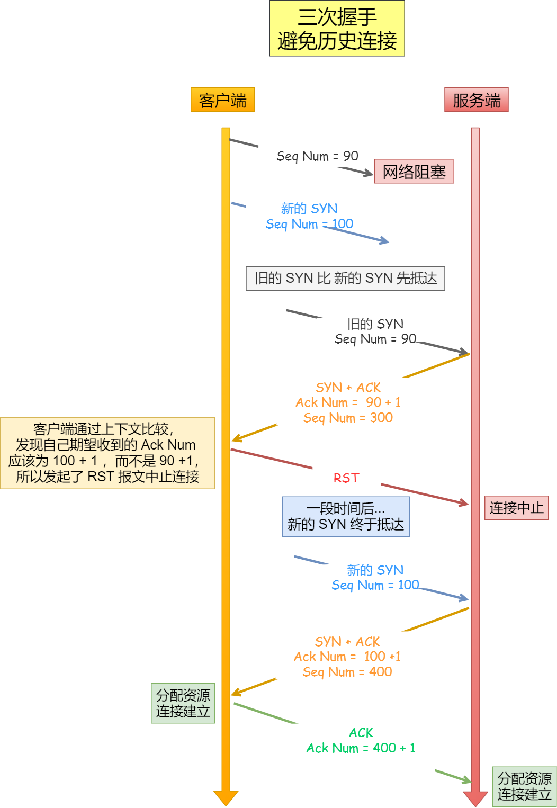

<!--
 * @Author: yao fanghao
 * @Date: 2023-06-06 16:31:04
 * @LastEditTime: 2023-06-14 18:05:44
 * @LastEditors: yao fanghao
-->
# 参考资料

* **计算机网络-自顶向下方法**
* **计算机网络-谢希仁** √
* **UNP**
* 王道-计算机网络 √
* 网络是怎样连接的 √
* 小林coding-图解网络
* https://xiaolincoding.com
* 图解TCP/IP √
* 嵌入式软件开发笔试面试指南
* [【计算机网络微课堂】](https://www.bilibili.com/video/BV1c4411d7jb/)
* [【中科大郑烇《计算机网络（自顶向下方法 第7版》】](https://www.bilibili.com/video/BV1JV411t7ow/)
* [【史上最强最细腻的linux嵌入式C语言学习教程【李慧芹老师】】](https://www.bilibili.com/video/BV18p4y167Md/)
* [【黑马程序员-Linux网络编程】](https://www.bilibili.com/video/BV1iJ411S7UA/)

# 2.1 TCP/IP 网络模型有哪几层？

* OSI七层协议： 物理层--数据链路层--网络层--传输层--会话层--表示层--应用程序层
* 五层协议：**物理层--数据链路层--网络层--传输层--应用层**
* **下面的协议对上面的实体是透明的**
  |  层   | 分组  | 协议  | 有关概念 |
  |  ----  | ----  | ---- | --- |
  | 应用层  | 报文 message | HTTP、SMTP、FTP等  | DNS、WWW、DHCP |
  | 传输层  | 报文段 segment | **TCP、UDP**  | TCP三次握手四次挥手、流量控制、超时重传、拥塞控制、最大报文段长度MSS、滑动窗口、端口 |
  | 网络层  | IP数据报 datagram | **IP、ICMP、ARP**等  | 网络号、主机号、子网掩码、路由、MAC头部、路由器 |
  | 链路层  | 帧 frame | PPP等  | 最大传输单元MTU、差错检测、后退N帧协议、CSMA/CD、网桥 |
  | 物理层  | 比特 bit |   | HUB集线器 |

  

# 2.2 键入网址到网页显示，期间发生了什么？

|  步骤   | 有关概念  |
|  ----  | ----  |
|  1、浏览器解析URL  | URI 统一资源标识符。相当于身份证号； URL 统一资源定位符。包括hhtp: ftp: 等。相当于身份证住址姓名等  |
| 2、生成HTTP请求消息 | **GET** **POST** 等方法 |
| 3、DNS域名解析 | DNS相当于电话本； DNS的存放是树状结构：顶级域名、二级域名、子域名 |
| 4、委托协议栈发送消息 | **ICMP**协议告知网络包传送过程中产生的错误以及各种控制信息； **ARP**协议根据 IP 地址查询相应的以太网 MAC 地址。 |
| 4.1 可靠传输TCP | TCP报文生成 |
| 4.2 委托IP封装成网络包 |  |
| 4.3 加上MAC头部 | ARP协议， arp -a |
| 5、通过网卡发送数据 | 数字信息转为电信号 |
| 6、交换机 | 二层网络设备 |
| 7、路由器 | 路由表查询转发； **子网掩码 & IP地址**，与目标地址匹配 |
| 8、服务器端解析包 | |

* 网络包的报文段组成：
  

# HTTP

## -基本概念

* 超文本传输协议
  

* HTTP 常见字段
  * Host： 客户端发送请求时，用来指定服务器的域名
    * ```Host: www.xxx.com```
  * Content-Length： 服务器返回数据时表明回应的数据长度
  * Connection： 客户端要求服务端长连接
    * 只要任意一端没有提出断开连接，则保持TCP连接状态
    * ```Connection: Keep-Alive```
  * Content-Type： 服务器回应时告诉客户端，数据是什么格式
  * Accpet: 表明客户端接受的数据格式
    * ```Accept: */*```

* **GET**
  * 从服务器获取指定的资源
* **POST**
  * 根据请求符合对指定资源处理

* HTTP缓存技术
  * 强制缓存和协商缓存技术

## -技术

* **cookie**
  * 允许站点对用户标识跟踪

* HTTP/1.0
  * 短连接
* HTTP/1.1
  * 长连接
  * 管道网络传输
* HTTP/2
  * 相比HTTP/1.1的改进：头部压缩、二进制格式、并发传输、服务器主动推送资源
* HTTP/3
  * 把下层TCP改成了UDP，且实现了新的协议QUIC
* HTTPS
  * **HTTPS 在 HTTP 与 TCP 层之间加入了 SSL/TLS 协议**
  * 信息加密、校验机制、身份证书
  * HTTPS协议本身到目前为止还是没有任何漏洞的
* HTTP的优化对比：
  

## -这里小林coding关于HTTP一章写得比较详细，没有仔细读，后续再看

# TCP

## -报文格式


* **序列号**
  * 解决网络包乱序问题
* **确认应答号**
  * 解决丢包问题
  * **若确认号为N，表明到序号N-1为止所有数据已正确收到**
* 控制位
  * **ACK** 为1时确认号有效
  * RST 为1时需重连
  * **SYN** 为1时表明连接请求或连接接受
    * SYN=1 ACK=0 连接请求
    * SYN=1 ACK=1 对方已同意建立连接
  * FIN 为1时表明发送完毕
  
* 建立一个 TCP 连接是需要客户端与服务端达成三个信息的共识
  * Socket：由 IP 地址和端口号组成
  * 序列号：用来解决乱序问题等
  * 窗口大小：用来做流量控制

## -TCP和UDP的区别

| |  TCP   | UDP  |
| --- | ----  | ----  |
| 连接 | 面向连接，需要先建立连接 | 不需要连接，即刻传输 |
| 服务对象 | 一对一 | 一对一、一对一、一对多 |
| 可靠性 | 可靠交付，无差错，不丢失，不重复，按序到达 | 尽最大努力交付，不保证可靠交付 （新技术：**QUIC**实现了可靠传输）|
| 拥塞控制、流量控制 | 有 | 无 |
| 传输方式 | **流式传输**，没有边界，保证顺序和可靠 | 按包发送，有边界，但可能会丢包和乱序 |
| 分片不同 | MSS | MTU |
| 应用 | SMTP、TELNET、HTTP、FTP | DNS、SNMP |

## -连接建立-三次握手


* 第三次握手可以携带数据，前两次握手不可以携带数据
* netstat -napt 命令查看TCP连接状态
* 三次握手才可以阻止重复历史连接的初始化（主要原因）:
  

* 三次握手才可以同步双方的初始序列号
* 三次握手才可以避免资源浪费

* 每次建立TCP连接时，初始化序列号不一样

* MTU和MSS：
  * 为了达到最佳的传输效能，建立TCP连接的时候通常要协商双方的 MSS 值
  * 当 TCP 层发现数据超过 MSS 时，则就先会进行分片
  

* 第一次握手丢失了，会发生什么？
  * 客户端触发超时重传，重传SYN报文
  * 重传次数由内核参数tcp_syn_retries控制
* 第二次握手丢失了，会发生什么？
  * **客户端和服务端都会重传**
  * 客户端触发超时重传，重传SYN报文
  * 服务端触发超时重传，重发SYN-ACK报文
* 第三次握手丢失了，会发生什么？
  * 服务端触发超时重传，重发SYN-ACK报文

* SYN攻击
  * 攻击者伪造SYN报文，服务端每收到便发出SYN-ACK报文
  * 久而久之占满服务端的半连接队列
  * 避免SYN攻击：调大 netdevmaxbacklog；增大 TCP 半连接队列；开启 tcp_syncookies；减少 SYN+ACK 重传次数

## -连接释放-四次挥手


* 每个方向都需要一个 FIN 和一个 ACK

* TEAM_WAIT 状态
  * 足以让两个方向上的数据包都被丢弃，使得原来连接的数据包在网络中都自然消失，再出现的数据包一定都是新建立连接所产生的

* 保活计时器

## -有限状态机FSM

  

## -重传

* **RTT** 往返时延
  * 数据发送时刻到接收到确认的时刻的差值
  * 指数加权移动平均估计RTT
* RTO 超时重传时间
  * RTO较长：网络空隙时间增大，降低传输效率
  * RTO较短：网络负荷增大，有不必要的重传
* RTO 应略大于 RTT
  
* 超时重传
  * 每遇到一次超时重传，都会将下一次超时时间间隔设为先前值的两倍
  * tcp_synack_retries
  
* 快速重传

* SACK
  * 只重传丢失的数据
  * 在 TCP 头部字段加一个 SACK ，可以将已收到数据的信息发送给发送方
  
* D-SACK
  * 使用了 SACK 告诉发送方有哪些数据被重复接收了

## -滑动窗口

* 窗口大小就是指无需等待确认应答，而可以继续发送数据的最大值

* 发送方的滑动窗口swnd：
  
  

* 指针实现：
  * SND.WND
  * SND.UNA
  * SND.NXT

* 接收方的滑动窗口rwnd：
  

## -流量控制


* 窗口探测报文
  * 防止窗口关闭时潜在的死锁现象
* 糊涂窗口综合症
* Nagle算法

## -拥塞控制

* 避免发送方数据填满整个网络
* **拥塞窗口 cwnd**
  * swnd = min(cwnd, rwnd)
  * 
* 拥塞控制的四个算法
  * 慢启动
    * 当发送方每收到一个 ACK，拥塞窗口 cwnd 的大小就会加 1
    * 指数型增长
  * 拥塞避免
    * 慢启动门限 ssthresh 
    * cwnd < ssthresh 时，使用慢启动算法
    * cwnd >= ssthresh 时，使用拥塞避免算法
    * 每当收到一个 ACK 时，cwnd 增加 1/cwnd
  * 拥塞发生
    * 当发生超时重传时，就会使用拥塞避免算法
    * ssthresh 设置为 cwnd/2
  * 快速恢复

## -半连接队列和全连接队列

 