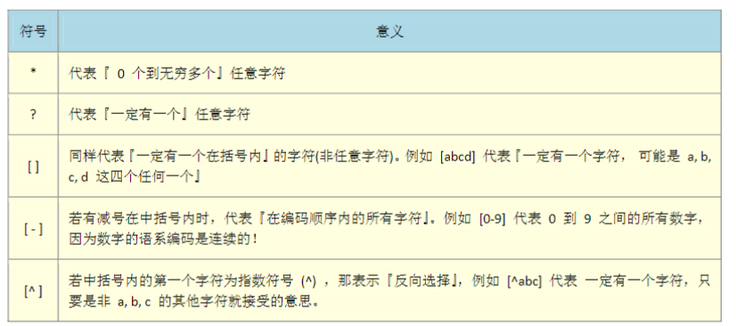
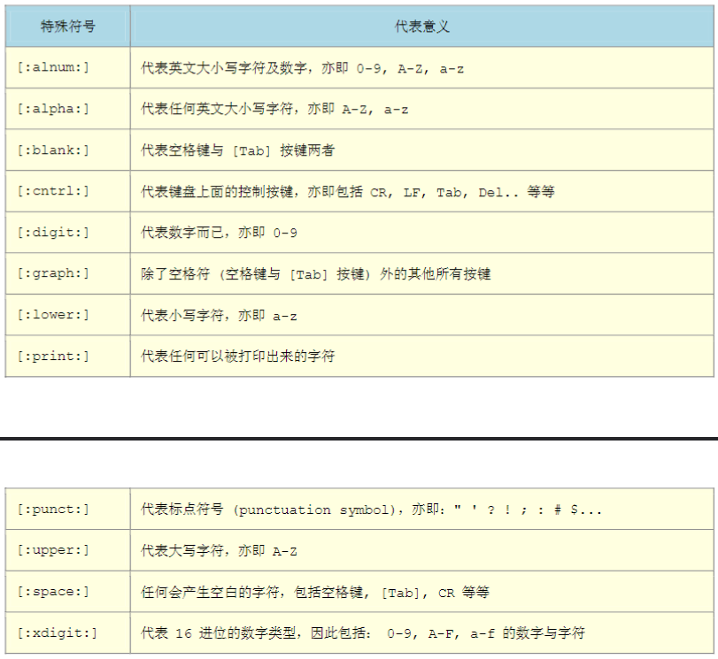

<!--
 * @Author: yao fanghao
 * @Date: 2023-10-27 10:51:33
 * @LastEditTime: 2023-11-13 14:26:40
 * @LastEditors: yao fanghao
-->

# 测试开发自学记录

* 2023.10.27-

# 参考资料

* CSAPP
* Linux命令行与shell编程脚本大全
* 鸟哥的Linux私房菜
* https://www.bilibili.com/video/BV1WY4y1H7d3

# 学习进度

## 已学习

* 鸟哥 第10-12章
* Linux命令行与shell编程脚本大全 第5-6，11-25章

## 学习中

* 尚硅谷网课 p80

## 认识bash

* 通过shell实现指令与kernel的沟通，控制硬件

* type 测试是否为内建指令

* env 列出所有shell环境变量
* **echo $[变量]** 查看某变量值
* **set** 列出所有环境变量和自定义变量
* unset 删除环境变量
* **export** 自定义变量转换成环境变量

* echo $? 查看最后一个执行命令的状态码

* alias 起别名
  
* | 管道命令
* cut grep
* sort wc uniq

## 结构化命令

* **if语句**
```shell
if command 
    then commands 
else
    commands
fi
```
```shell
if command1
then
   commands
elif command2
then
    more commands
fi
```

* test语句
  * 测试condition语句，如果返回非0状态码，则if-then语句不被执行
```shell
test condition
```
```shell
if test condition
    then commands 
fi
```
```shell
if [ condition ]
    then commands 
fi
```

* **case语句**
```shell
case variable in
pattern1 | pattern2) 
    commands1;;
pattern3) 
    commands2;;
*) default 
    commands;;
esac
```

* **for语句**
  * 用空格划分list列表内的每个值
  * 可以临时更改环境变量IFS，更改字段分隔符
```shell
IFS.OLD=$IFS
IFS=$'\n'
for var in list
do
    commands
done
IFS=$IFS.OLD
```

* C语言风格的for语句
```shell
for (( i=1; i <= 10; i++ ))
do
    echo "The next number is $i"
done
```

* **while语句**
```shell
while test command
do
    other commands
done
```

* until语句
```shell
until test commands
do
   other commands
done
```

* break命令
  
* continue命令

* 文件名通配符匹配
```shell
for file in /home/rich/test/*
do
    if [ -d "$file" ]
    then
      echo "$file is a directory"
    elif [ -f "$file" ]
    then
      echo "$file is a file"
    fi
done
```

* 数值比较
  * -eq -ge -gt -le -lt -ne

* 字符串比较
  * = != < >
  * -n -z

* 文件比较
    语句     | 作用
    -------- | -----
    -d file  | 检测是否存在且为目录
    -e file  | 检测是否存在
    -f file  | 检测是否存在且为文件
    -r file  | 检测是否存在且可读
    -s file  | 检测是否存在且非空
    -w file  | 检测是否存在且可写
    -x file  | 检测是否存在且可执行
    -O file  | 检测是否存在且属当前用户
    file1 -nt file2  | 检测file1是否比file2新
    file1 -ot file2  | 检测file1是否比file2旧

* 复合条件 && ||
* 双括号实现计算数学表达式 (( expression ))
* 双方括号实现字符串模式匹配 [[ expression]]

## 处理用户输入

* 位置参数
  * $0脚本名 $1第一个命令行参数 ...

* $* 将所有命令行参数视为一个单词
* $@ 将各个命令行参数视为独立单词

* **getopt**
  * 定义了有效的命令行选项字母
  * -q 忽略错误信息
```shell
getopt optstring parameters
```

* **getopts**
  * 解析命令行参数

* read 获取用户输入
  * -t 超时等待的计时器

## 呈现数据

* **标准文件描述符** 0 1 2
  * stdin:0 stdout:1 stderr:2

* lsof
  * -p 指定进程PID
  * -d 指定文件描述符编号

* **2 > /dev/null**
  * 黑洞装置，快速清除现有输出

* mktemp 创建本地临时文件
  * -t 在系统目录/tmp中创建
  * -d 创建临时目录
  * 6个X自动替换为任意字符
```shell
mktemp -t testing.XXXXXX
```

* **tee** 双重管道

## 脚本控制

* 常用信号
  信号     |  |  作用 |
  -------- | ----- | ----- | -----
  1  | SGIHUP | hang up 挂起进程 |
  2  | SGIINT | interrupt 中断进程  | Ctrl+C
  3  | SGIQUIT | stop 停止进程  | Ctrl+\
  9  | SGIKILL | terminate 无条件终止进程  |
  18  | SGICONT | 继续运行停止的进程  |
  19  | SGISTOP | 无条件停止，但不终止进程  |
  20  | SGISTP | 停止或暂停，但不终止进程  | Ctrl+Z

* kill 杀死信号
  * -9 发送SIGKILL信号

* trap 捕获信号
```shell
trap commands signals 
```
```shell
trap "echo 'Interrupt signal received'" SIGINT
```

* 后台运行脚本：在脚本名后加&即可

* nohup 在后台运行脚本

* 作业控制
  * bg 以后台模式重启
  * fg 以前台模式重启
  * nice 调度优先级，-20~+19，值越低优先级越高
  * at 指定时间运行作业
  * atq 查看正在等待的作业
  * atrm 删除等待中的作业

## 创建函数

* function
  * 先定义再调用
  * $# 函数参数数量
  * $1 $2 ... 传递函数参数
  * return 设定返回值
```shell
function name {
    commands
    return $[ value ]
}
```

* local 设定局部变量
* ${array[*]} 函数内外传递数组

* 可以使用函数递归

* 创建函数库文件
  * source 运行库文件
  * ./[库名] 点号操作符 运行库文件

* 在.bashrc文件夹中定义函数

## sed 和 gawk

* sed编辑器（流编辑器）
  * 通过管道将数据传入sed进行处理
  * 不修改文本数据，只是将修改后的结果发送到STDOUT
  * s 替换，旧字符串替换为新的 ```shell sed's/old/new'```
  * 替换标志 -g -p -w
  * d 删除
  * i 插入
  * a 附加
  * c 修改
  * -e 执行多个sed命令
```shell
sed options script file
```

* gawk编辑器
```shell
gawk options program file
```

## 正则表达式

* 通配符
  

* 特殊符号
  

* grep的一些高级用法
  * -n 搜索
  * -vn 反向搜索
  * -in 忽略大小写
  * ^ 行首字符
  * $ 行尾字符
  * [] 查找集合字符
  * [^] 反向查找集合字符

* 更多内容参考**鸟哥私房菜第11章**