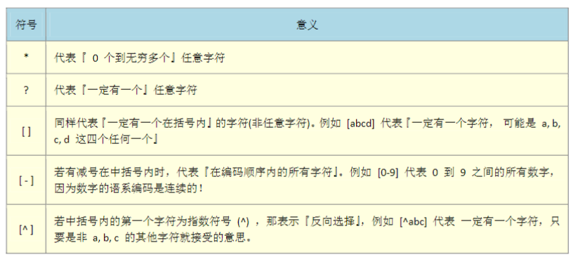
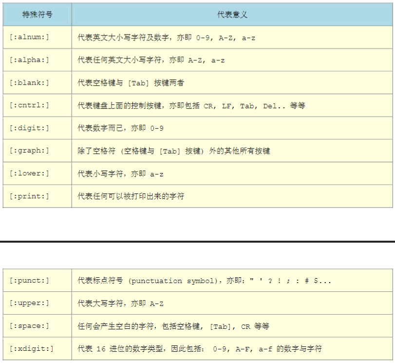

<!--
 * @Author: yao fanghao
 * @Date: 2023-10-27 10:51:33
 * @LastEditTime: 2023-11-13 14:26:40
 * @LastEditors: yao fanghao
-->

# 测试开发自学记录

* 2023.10.27-

# 参考资料

* CSAPP
* Linux命令行与shell编程脚本大全
* 鸟哥的Linux私房菜
* https://www.bilibili.com/video/BV1WY4y1H7d3

# 学习进度

## 已学习

* 鸟哥 第10-12章
* Linux命令行与shell编程脚本大全 第5-6，11-25章

## 学习中

* 尚硅谷网课 p80

## 认识bash

* 通过shell实现指令与kernel的沟通，控制硬件

* type 测试是否为内建指令

* env 列出所有shell环境变量
* **echo $[变量]** 查看某变量值
* **set** 列出所有环境变量和自定义变量
* unset 删除环境变量
* **export** 自定义变量转换成环境变量

* echo $? 查看最后一个执行命令的状态码

* alias 起别名
  
* | 管道命令
* cut grep
* sort wc uniq

## 结构化命令

* **if语句**
```shell
if command 
    then commands 
else
    commands
fi
```
```shell
if command1
then
   commands
elif command2
then
    more commands
fi
```

* test语句
  * 测试condition语句，如果返回非0状态码，则if-then语句不被执行
```shell
test condition
```
```shell
if test condition
    then commands 
fi
```
```shell
if [ condition ]
    then commands 
fi
```

* **case语句**
```shell
case variable in
pattern1 | pattern2) 
    commands1;;
pattern3) 
    commands2;;
*) default 
    commands;;
esac
```

* **for语句**
  * 用空格划分list列表内的每个值
  * 可以临时更改环境变量IFS，更改字段分隔符
```shell
IFS.OLD=$IFS
IFS=$'\n'
for var in list
do
    commands
done
IFS=$IFS.OLD
```

* C语言风格的for语句
```shell
for (( i=1; i <= 10; i++ ))
do
    echo "The next number is $i"
done
```

* **while语句**
```shell
while test command
do
    other commands
done
```

* until语句
```shell
until test commands
do
   other commands
done
```

* break命令
  
* continue命令

* 文件名通配符匹配
```shell
for file in /home/rich/test/*
do
    if [ -d "$file" ]
    then
      echo "$file is a directory"
    elif [ -f "$file" ]
    then
      echo "$file is a file"
    fi
done
```

* 数值比较
  * -eq -ge -gt -le -lt -ne

* 字符串比较
  * = != < >
  * -n -z

* 文件比较
    语句     | 作用
    -------- | -----
    -d file  | 检测是否存在且为目录
    -e file  | 检测是否存在
    -f file  | 检测是否存在且为文件
    -r file  | 检测是否存在且可读
    -s file  | 检测是否存在且非空
    -w file  | 检测是否存在且可写
    -x file  | 检测是否存在且可执行
    -O file  | 检测是否存在且属当前用户
    file1 -nt file2  | 检测file1是否比file2新
    file1 -ot file2  | 检测file1是否比file2旧

* 复合条件 && ||
* 双括号实现计算数学表达式 (( expression ))
* 双方括号实现字符串模式匹配 [[ expression]]

## 处理用户输入

* 位置参数
  * $0脚本名 $1第一个命令行参数 ...

* $* 将所有命令行参数视为一个单词
* $@ 将各个命令行参数视为独立单词

* **getopt**
  * 定义了有效的命令行选项字母
  * -q 忽略错误信息
```shell
getopt optstring parameters
```

* **getopts**
  * 解析命令行参数

* read 获取用户输入
  * -t 超时等待的计时器

## 呈现数据

* **标准文件描述符** 0 1 2
  * stdin:0 stdout:1 stderr:2

* lsof
  * -p 指定进程PID
  * -d 指定文件描述符编号

* **2 > /dev/null**
  * 黑洞装置，快速清除现有输出

* mktemp 创建本地临时文件
  * -t 在系统目录/tmp中创建
  * -d 创建临时目录
  * 6个X自动替换为任意字符
```shell
mktemp -t testing.XXXXXX
```

* **tee** 双重管道

## 脚本控制

* 常用信号
  信号     |  |  作用 |
  -------- | ----- | ----- | -----
  1  | SGIHUP | hang up 挂起进程 |
  2  | SGIINT | interrupt 中断进程  | Ctrl+C
  3  | SGIQUIT | stop 停止进程  | Ctrl+\
  9  | SGIKILL | terminate 无条件终止进程  |
  18  | SGICONT | 继续运行停止的进程  |
  19  | SGISTOP | 无条件停止，但不终止进程  |
  20  | SGISTP | 停止或暂停，但不终止进程  | Ctrl+Z

* kill 杀死信号
  * -9 发送SIGKILL信号

* trap 捕获信号
```shell
trap commands signals 
```
```shell
trap "echo 'Interrupt signal received'" SIGINT
```

* 后台运行脚本：在脚本名后加&即可

* nohup 在后台运行脚本

* 作业控制
  * bg 以后台模式重启
  * fg 以前台模式重启
  * nice 调度优先级，-20~+19，值越低优先级越高
  * at 指定时间运行作业
  * atq 查看正在等待的作业
  * atrm 删除等待中的作业

## 创建函数

* function
  * 先定义再调用
  * $# 函数参数数量
  * $1 $2 ... 传递函数参数
  * return 设定返回值
```shell
function name {
    commands
    return $[ value ]
}
```

* local 设定局部变量
* ${array[*]} 函数内外传递数组

* 可以使用函数递归

* 创建函数库文件
  * source 运行库文件
  * ./[库名] 点号操作符 运行库文件

* 在.bashrc文件夹中定义函数

## sed 和 gawk

* sed编辑器（流编辑器）
  * 通过管道将数据传入sed进行处理
  * 不修改文本数据，只是将修改后的结果发送到STDOUT
  * s 替换，旧字符串替换为新的 ```shell sed's/old/new'```
  * 替换标志 -g -p -w
  * d 删除
  * i 插入
  * a 附加
  * c 修改
  * -e 执行多个sed命令
```shell
sed options script file
```

* gawk编辑器
```shell
gawk options program file
```

## 正则表达式

* 通配符
  

* 特殊符号
  

* grep的一些高级用法
  * -n 搜索
  * -vn 反向搜索
  * -in 忽略大小写
  * ^ 行首字符
  * $ 行尾字符
  * [] 查找集合字符
  * [^] 反向查找集合字符

* 更多内容参考**鸟哥私房菜第11章**

## awk 高级用法

### 内置变量

| 变量 | 说明 |
|------|------|
| NR | 当前处理的行号 |
| NF | 当前行字段数量 |
| $0 | 当前整行内容 |
| $1, $2, ... | 当前行第N个字段 |
| FS | 字段分隔符（默认空白） |
| OFS | 输出字段分隔符 |

### 模式匹配与动作

```shell
# 打印第2列值大于100的行
awk '$2 > 100 { print NR": "$0 }' data.txt

# 使用正则匹配行
awk '/^ERROR/ { print $1, $NF }' log.txt

# 自定义分隔符
awk -F: '{ print $1, $3 }' /etc/passwd

# BEGIN 和 END 块
awk 'BEGIN { print "Start" } { sum += $1 } END { print "Sum:", sum }' nums.txt
```

### awk 数组

```shell
# 统计IP访问次数
awk '{ count[$1]++ } END { for (ip in count) print ip, count[ip] }' access.log

# 数组排序（以索引遍历）
awk '{ arr[$1] = $2 } END {
    n = asorti(arr, sorted)
    for (i = 1; i <= n; i++) print sorted[i], arr[sorted[i]]
}' data.txt
```

### awk 自定义函数

```shell
awk '
function max(a, b) {
    return a > b ? a : b
}
{ print max($1, $2) }
' nums.txt
```

## sed 高级用法

### 地址范围与多命令

```shell
# 在第2行到第5行之间替换
sed '2,5s/old/new/g' file.txt

# 从匹配行到文件末尾
sed '/START/,$d' file.txt

# 多个命令：用-e或用花括号
sed -e 's/foo/bar/' -e 's/baz/qux/' file.txt
sed '/PATTERN/ {
    s/foo/bar/
    s/baz/qux/
}' file.txt
```

### 多行模式（N、P、D）

```shell
# N：读取下一行追加到模式空间
sed 'N; s/\n/, /' file.txt     # 将两行合并为一行

# P：打印模式空间的第一行
# D：删除模式空间的第一行，重新循环
# 典型用法：折叠段落
sed '/./{ H; $!d }; x; s/^\n//' file.txt  # 将空行分割的段落合并为一行
```

### sed 脚本示例

```shell
# 在匹配行后插入内容
sed '/LISTEN/a# New entry' file.txt

# 在第3行前插入
sed '3i\This is inserted before line 3' file.txt

# 只打印匹配行范围
sed -n '/START/,/END/p' file.txt
```

## Shell 调试技巧

| 命令 | 说明 |
|------|------|
| set -x | 打印每条命令及展开后的参数 |
| set +x | 关闭调试 |
| set -e | 遇到非零退出码立即退出（errexit） |
| set -u | 使用未定义变量时报错（nounset） |
| set -o pipefail | 管道命令中任一失败即返回失败 |

```shell
# 脚本开头统一启用严格模式
set -euo pipefail

# 或只在部分代码段开启调试
set -x
# ... 调试代码 ...
set +x
```

## xargs 与 find 搭配

```shell
# 删除找到的文件（处理文件名含空格的情况）
find . -name "*.tmp" -print0 | xargs -0 rm -f

# 并行执行
find . -name "*.jpg" -print0 | xargs -0 -P 4 -I {} convert {} {}.png

# 使用 -exec 替代 xargs
find . -name "*.log" -exec gzip {} \;

## 数组

```shell
# 声明数组
my_array=(apple banana cherry)
my_array[3]="date"

# 访问
echo ${my_array[0]}          # apple
echo ${my_array[@]}          # 所有元素
echo ${#my_array[@]}         # 数组长度

# 遍历
for item in "${my_array[@]}"; do
    echo "$item"
done
```

## 关联数组（Bash 4+）

```shell
declare -A user
user[name]="Alice"
user[age]=30
user[city]="Beijing"

echo ${user[name]}           # Alice
echo ${!user[@]}             # 所有键：name age city

# 遍历
for key in "${!user[@]}"; do
    echo "$key: ${user[$key]}"
done
```

## 字符串操作

```shell
str="hello-world"

echo ${#str}                 # 长度：11
echo ${str:0:5}              # 切片：hello
echo ${str:6}                # 从第7个字符开始：world
echo ${str/world/there}      # 替换第一个匹配：hello-there
echo ${str//-/_}             # 替换所有匹配：hello_world
echo ${str%-*}               # 从右删除最短匹配：hello
echo ${str%%-*}              # 从右删除最长匹配：hello
echo ${str#*-}               # 从左删除最短匹配：world
echo ${str##*-}              # 从左删除最长匹配：world
```

## 算数运算

```shell
# 整数运算（推荐 $((...)) 而非 $[...]）
a=5; b=3
echo $((a + b))              # 8
echo $((a * b))              # 15
echo $((a ** b))             # 幂运算：125
echo $(( (a + b) * 2 ))     # 16

# bc 浮点数运算
echo "scale=2; 10 / 3" | bc  # 3.33
```

## 文件包含与 source

```shell
# source 在当前 shell 中执行脚本
source ./config.sh
. ./config.sh                # 点号是 source 的简写

# config.sh 示例
# DB_HOST="localhost"
# DB_PORT=3306
# DB_USER="root"
```

## Here Document

```shell
cat <<EOF
Hello, this is a here document.
It can contain $variables and `commands`
EOF

# 禁止变量展开（用引号包裹定界符）
cat <<'EOF'
$HOME will NOT be expanded
EOF

# 写入文件
cat <<EOF > output.txt
line1
line2
EOF
```

## 重定向深入

```shell
# 标准输出和错误分别重定向
command > stdout.log 2> stderr.log

# 合并标准输出和错误
command > all.log 2>&1
command &> all.log           # Bash 4+ 简写
command 2>&1 | less          # 管道中合并

# 同时输出到文件和终端
command | tee log.txt
command | tee -a log.txt     # 追加模式

# 从文件读取到 stdin
command < input.txt

# 文件描述符操作
exec 3> output.txt           # 打开文件描述符3用于写入
echo "hello" >&3             # 写入fd 3
exec 3>&-                    # 关闭fd 3
```

## 进程替换

```shell
# 将命令输出作为文件使用
diff <(ls dir1) <(ls dir2)   # 比较两个目录

# 从进程替换中读取
while read line; do
    echo ">> $line"
done < <(grep ERROR log.txt)
```

## 常用内建命令

| 命令 | 说明 |
|------|------|
| `:` (空命令) | 永远返回0，用于无限循环 `while :; do ... done` |
| `.` (source) | 在当前 shell 执行脚本 |
| `exec` | 替换当前进程或重定向文件描述符 |
| `shift [n]` | 参数左移 n 位 |
| `readonly` | 声明只读变量 |
| `declare/typeset` | 声明变量属性（-i整数 -a数组 -A关联数组 -r只读 -x导出） |
| `eval` | 执行字符串作为命令 |
| `builtin` | 强制使用内建命令而非外部命令 |

## 实用脚本模式

### 安全模板

```shell
#!/bin/bash
set -euo pipefail
IFS=$'\n\t'

# 脚本名和参数
SCRIPT_NAME=$(basename "$0")
echo "Running $SCRIPT_NAME..."

# 清理函数
cleanup() {
    rm -f /tmp/temp_$$
    echo "Cleanup done"
}
trap cleanup EXIT

# 主逻辑
main() {
    echo "Script body..."
}
main "$@"
```

### 命令行参数解析（getopts）

```shell
#!/bin/bash
usage() {
    echo "Usage: $0 [-v] [-o output] [-n count] input"
    exit 1
}

verbose=0
output=""
count=1

while getopts ":vo:n:" opt; do
    case $opt in
        v) verbose=1 ;;
        o) output="$OPTARG" ;;
        n) count="$OPTARG" ;;
        :) echo "Option -$OPTARG requires an argument" >&2; usage ;;
        *) usage ;;
    esac
done
shift $((OPTIND - 1))
```

### 日志函数

```shell
#!/bin/bash
LOG_FILE="/var/log/myscript.log"

log_info() {
    echo "[INFO] $(date '+%Y-%m-%d %H:%M:%S') $*" | tee -a "$LOG_FILE"
}

log_error() {
    echo "[ERROR] $(date '+%Y-%m-%d %H:%M:%S') $*" >&2 | tee -a "$LOG_FILE" >&2
}

log_info "Script started"
log_error "Something went wrong"
```

### 并发控制

```shell
#!/bin/bash
# 限制并发数为 N 的并行任务

max_jobs=4
task_list=(task1 task2 task3 task4 task5 task6)

for task in "${task_list[@]}"; do
    # 后台执行
    ( sleep 2; echo "Done: $task" ) &

    # 控制并发数：当后台任务数达到上限时等待
    while [[ $(jobs -r | wc -l) -ge $max_jobs ]]; do
        sleep 0.5
    done
done

# 等待所有后台任务完成
wait
echo "All tasks done"
```

### 彩色输出

```shell
#!/bin/bash
RED='\033[0;31m'
GREEN='\033[0;32m'
YELLOW='\033[1;33m'
BLUE='\033[0;34m'
NC='\033[0m' # No Color

print_green() { echo -e "${GREEN}$*${NC}"; }
print_red()   { echo -e "${RED}$*${NC}"; }
print_yellow(){ echo -e "${YELLOW}$*${NC}"; }

print_green "Success"
print_red "Error"
print_yellow "Warning"
```

## 常见错误与避坑指南

| 错误 | 正确做法 |
|------|---------|
| `[ $var = "val" ]`（var为空时语法错误） | `[ "$var" = "val" ]` |
| `for i in $(ls *.txt)`（文件名含空格会分裂） | `for i in *.txt` |
| `if grep pattern file`（管道中隐式返回码） | `if grep -q pattern file; then` |
| `cat file \| while read`（管道内变量赋值不持久） | `while read; do ... done < file` |
| `rm -rf $dir/`（$dir为空时删除根目录） | `rm -rf "${dir:?}/"` |
| `cmd &`（后台进程输出混乱） | `cmd &>/dev/null &` |
| `[ $? -ne 0 ]`（繁琐且不够精确） | `if ! command; then` |

## Shell 脚本性能优化

| 原则 | 反面示例 | 优化方案 |
|------|---------|---------|
| **减少外部命令** | `for i in $(cat file)` | `while read -r line; do done < file` |
| **避免循环内 grep/awk** | 每行调一次 grep | 先 awk 处理完再循环 |
| **用内置字符串操作** | `echo $var \| cut -d: -f1` | `${var%%:*}` |
| **用 printf 替代 echo** | `echo "$var"`（-n/-e 不可移植） | `printf '%s\n' "$var"` |
| **合并 pipe 链** | `grep x \| sort \| uniq` | `grep x \| sort -u` |
| **数组预分配** | 循环内逐个 append | 用 `mapfile` 一次性读入 |

```shell
# 慢：循环中频繁调用外部命令
for ip in $(cat ip_list.txt); do
    ping -c 1 $ip | grep "bytes from" > /dev/null
    if [ $? -eq 0 ]; then echo "$ip alive"; fi
done

# 快：先 awk 处理完，再循环
awk '{print $1}' ip_list.txt | while read ip; do
    if ping -c 1 "$ip" &>/dev/null; then
        echo "$ip alive"
    fi
done
```

## 跨平台 Shell 兼容性

### macOS (BSD) vs Linux (GNU) 差异

| 命令 | Linux (GNU) | macOS (BSD) |
|------|-------------|-------------|
| sed -i | `sed -i 's/old/new/g' file` | `sed -i '' 's/old/new/g' file` |
| date | `date -d "yesterday"` | `date -v -1d` |
| find | `find . -type f -printf '%f\n'` | `find . -type f -exec basename {} \;` |
| grep | `grep -P '\d+'` | `grep -E '[0-9]+'` |
| head/tail | `head -n -1`（排除最后一行） | 不支持负数 |

### 兼容写法

```shell
# 检测 OS
case "$(uname -s)" in
    Linux*)  sed_i='sed -i' ;;
    Darwin*) sed_i='sed -i ""' ;;
    *)       echo "Unsupported OS"; exit 1 ;;
esac
eval "$sed_i 's/old/new/g' file.txt"

# 获取昨天日期
if date -d "yesterday" >/dev/null 2>&1; then
    yesterday=$(date -d "yesterday" +%Y%m%d)  # GNU
else
    yesterday=$(date -v-1d +%Y%m%d)           # BSD
fi
```

### shebang 选择

| shebang | 说明 |
|---------|------|
| `#!/bin/bash` | Linux 默认，功能最全 |
| `#!/bin/sh` | POSIX 标准，可移植性好（但无数组/关联数组） |
| `#!/usr/bin/env bash` | 通过 PATH 寻找 bash，macOS 常用 |

## 日志轮转（logrotate）

```shell
# /etc/logrotate.d/myapp
/var/log/myapp/*.log {
    daily                    # 每日轮转
    rotate 7                 # 保留7份历史
    compress                 # 压缩历史日志
    delaycompress            # 延迟一天压缩
    missingok                # 文件不存在不报错
    notifempty               # 空文件不轮转
    copytruncate             # 先拷贝再截断（不中断程序写入）
    postrotate
        /bin/kill -HUP `cat /var/run/myapp.pid 2>/dev/null` 2>/dev/null || true
    endscript
}
```

```shell
# 手动触发测试
logrotate -vf /etc/logrotate.d/myapp
```