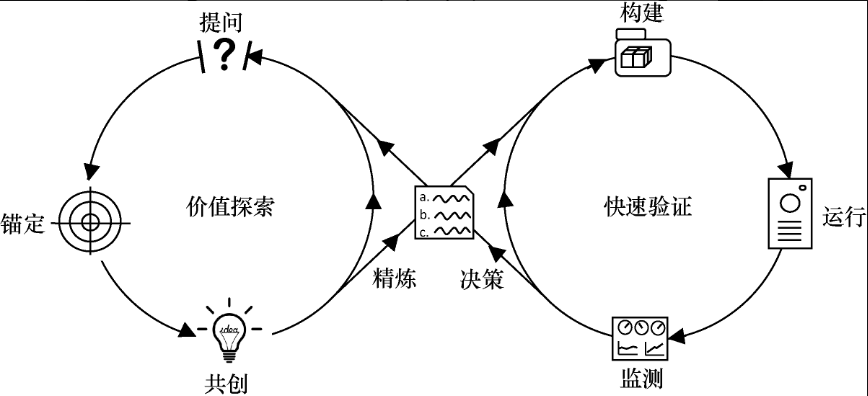
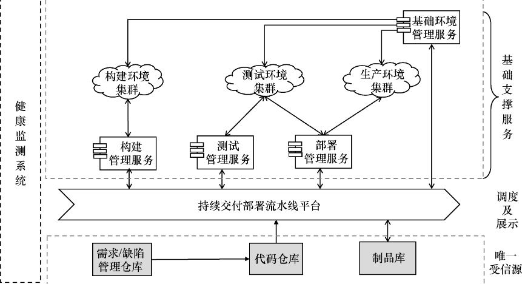
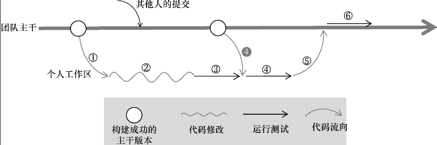
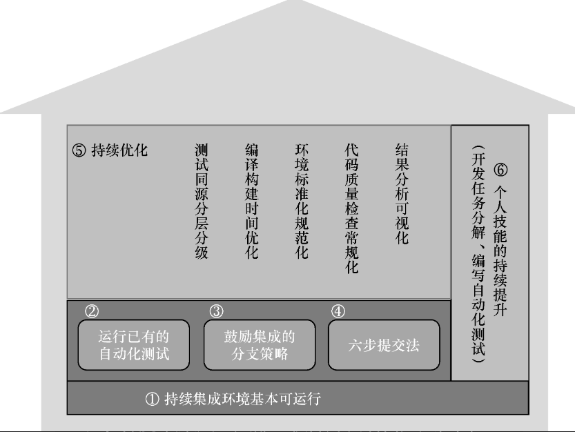
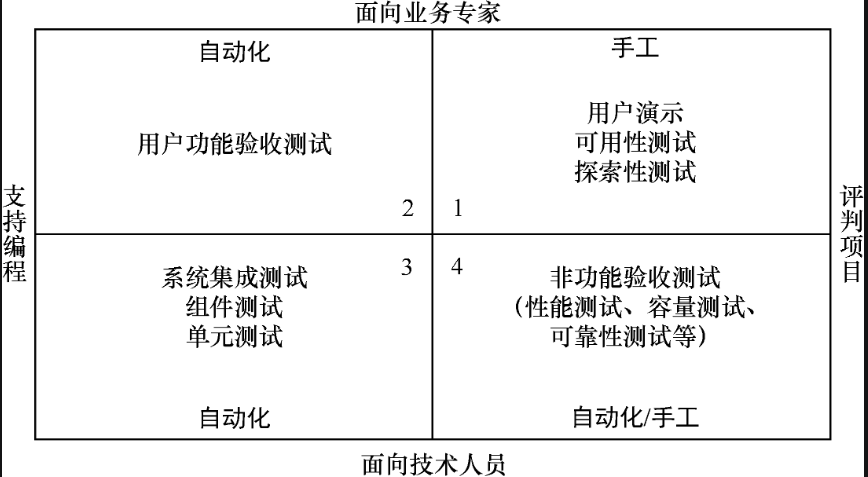
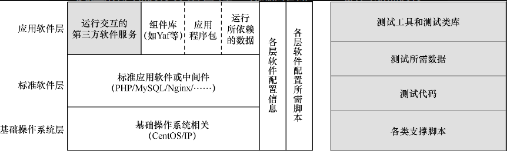
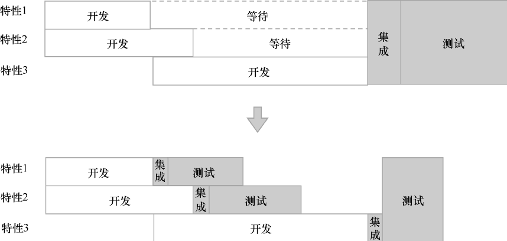

<!--
 * @Author: yao fanghao
 * @Date: 2023-11-13 15:21:18
 * @LastEditTime: 2023-11-15 11:52:49
 * @LastEditors: yao fanghao
-->
# 自学记录

2023.11.13-11.15

# 参考资料

* 持续交付2.0 乔梁
* 软件工程-实践者的研究方法 罗杰S普莱斯曼
* 大话软件工程-需求分析与软件设计
* 架构整洁之道
* 编程卓越之道-软件工程化
* DevOps入门与实践
* 设计模式
* 软件测试的艺术

## 概述

* 瀑布模型
* 敏捷开发
  * 迭代开发、增量开发
  * 涉及产品需求方、软开、软测
* DevOps
  * 统一软件开发和运维
  * 缩短开发周期，提高部署频率，更可靠发布
  * 涉及软开、软测、运维
* 持续交付2.0
  * 精益思想：需求拉动生产，避免浪费
  * 双环模型

## 双环模型

  

* **探索环**
  * 制订最小可行解决方案
  * 提问、锚定、共创、精炼
* **验证环**
  * 最快速度交付最小可行方案
  * 构建、运行、监测、决策
* 四个核心工作原则
  * 坚持少做
  * 持续分解问题
  * 坚持快速反馈
  * 持续改进并衡量

## 持续交付的软件系统架构

* 大系统小做
  * 系统拆分原则：高内聚、低耦合

* 常见的架构模式
    |  架构模式   | 特点  | 适用场景 |
    |  ----  | ----  | ---- |
    | 微核架构  | 插件通过核心框架进行通信，易发布、易测试等 | 客户端 |
    | **微服务架构**  | 将单一应用程序分为一组小服务，RESTful API，扩展性好、易部署、易开发 | 大型服务端系统  |7v
    | 分层的巨石应用  | 部署操作简单、快速迭代 | 创业公司或中小型项目 |

* 架构改造实施模式
  * 拆迁者模式
  * 绞杀者模式
  * 修缮者模式

## 业务需求协作管理

* 产品版本周期
  * 准备期、交付期

* 需求拆分的优点
  * 建立共识，协调工作
  * 小批量交付，加速价值流动
  * 低成本拥抱变化
  * 多次集成，及时反馈质量
  * 鼓舞团队士气

* 需求拆分的成本
  * 显式成本
  * 分批开发、测试和部署的迭代成本

* INVEST原则
  * 独立、可协商、有价值、可估算、规模小且适中、可验证

* 五大用户故事拆分法
  * 路径拆分法
  * 按接触点拆分
  * 按数据类型或格式拆分
  * 按规则拆分
  * 按探索路径拆分

* 需求分析与管理工具集
  * 用户故事地图
  * 用户故事树
  * 依赖关系图
  * 需求管理数字化平台

## 部署流水线

* 服务器\代理架构

* 初级部署流水线
  

* 流水线的设计原则
  * 一次构建，多次使用
  * 与业务逻辑松耦合
  * 并行化原则
  * 快速反馈优先
  * 重要反馈优先

* **部署流水线平台的构成**
    
  * 唯一受信源
    * 需求管理仓库、源代码仓库、制品库
  * 部署流水线平台
  * 四大基础支撑服务  
    * 编译构建管理服务
    * 自动化测试管理服务
    * 软件部署管理服务
    * 基础环境管理服务

## 版本控制

* 集中式、分布式
* 分支开发模式
  * 主干开发，主干发布
  * 主干开发，分支发布
  * 分支开发，主干发布

* GitHubFlow分支模式

* 版本发布模式
  * 项目制发布模式
  * 发布火车模式
  * 城际快线模式

## 持续集成

* 来源：极限编程
* 持续集成
  * 团队成员频繁提交，多次集成
  * 每次提交触发包含自动化验证集的构建任务

* **六步提交法**  
  
  * 检出最近成功的代码
  * 修改代码
  * 第一次个人构建
  * 第二次个人构建
  * 提交代码到团队主干
  * 提交构建

* 对持续集成最佳状态的自查表
  * 主干开发，频繁提交
  * 每次提交应该是一个完整的任务
  * 让提交构建在10分钟以内完成
  * 提交构建失败后应禁止团队成员提交新代码，也不许其他人检出该代码
  * 立即在10分钟内修复已失败的提交构建，否则回滚代码
  * 自动化构建验证通过后，对软件质量有比较大的信心

* 速度与质量的权衡
  * 分级构建
  * 多人同时提交的构建
  * 云平台

* **在团队中实施持续集成**
  
  * 构建脚本化，搭建持续集成框架
  * 添加已有的自动化验证集合
  * 选择利于持续集成的分支策略
  * 建立六步提交法
  * 持续优化
  * 个人技能持续提升

## 自动化测试

* 测试四象限
  

* 实施策略
  * 增加自动化测试用例的着手点
  * 提高自动化测试的执行次数
  * 良好自动化测试的特征
  * 共享自动化测试的维护职责
  * 代码测试覆盖率

* 用户验收自动化测试要点
  * 先搭建分层框架
    * 测试用例的描述层、实现层、接口层
  * 测试用例数应保持低位
  * 为自动化测试用例预留API
  * 为调试做好准备
  * 测试数据的准备

## 软件配置管理

* 原则
  * 一切皆有版本
  * 共享唯一受信源
    * 需求仓库、代码仓库、软件包仓库
  * 标准化与自动化

* 软件包的版本管理
  * 包管理的反模式
  * 集中式包管理服务
  * 软件包的元信息

* 环境基础设施管理
  * 以人脑+手工为代表的“蛮荒状态”
  * 以文档+私有脚本为代表的“规范化状态”
  * 以办公自动化为代表的“标准化状态”
  * 以受控式自动化脚本为代表的“自动化状态”

* 软件配置项的管理
  * 二进制与配置项
  * 配置信息的版本管理
  * 配置项的存储组织方式
  * 配置漂移与治理

* 不可变基础设施与云应用
  * 实现不可变基础设施
    * 物理机镜像、虚拟机镜像
    * Docker容器
  * 云原生应用

* 数据的版本管理

## 低风险发布

## 监测与决策

* 生产监测范围
  * 基础监测、应用监测、业务监测
  
* 数据监测体系
  
* 问题处理体系
  * 告警处理

* 测试左移
  
  
* 测试右移
  * 在生产环境运行
  * 混沌工程

## 大型互联网团队的FT化

《持续交付2.0》中14.3写得非常详细清楚，帮助很大

## 小团队逆袭之旅

《持续交付2.0》中15.3和15.4写得非常详细清楚，帮助很大

## 研发推动的DevOps

* 第一阶段：敏捷101
* 第二阶段：DevOps转型
