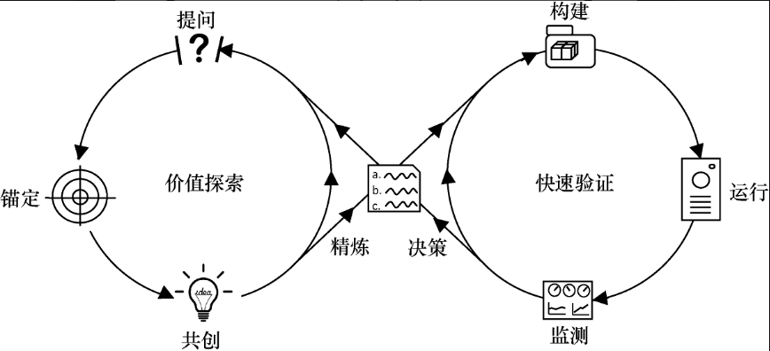
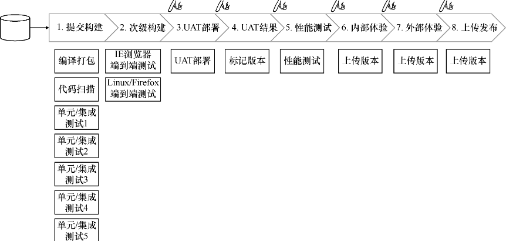
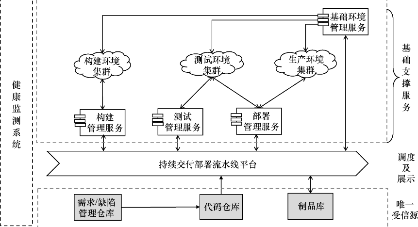
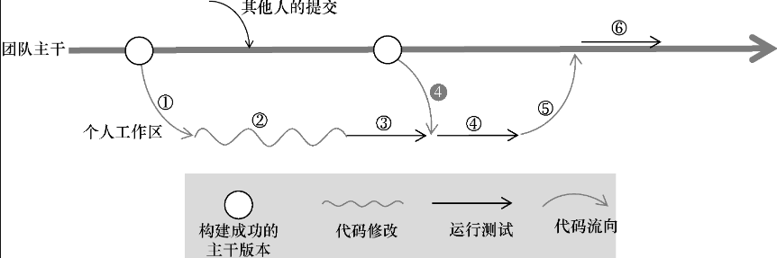
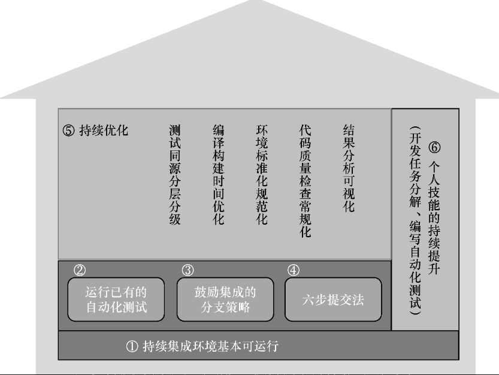
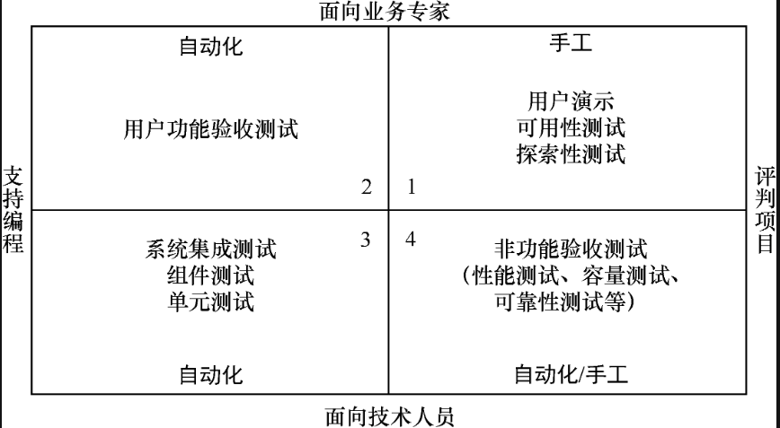
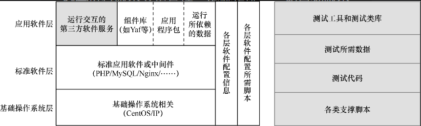
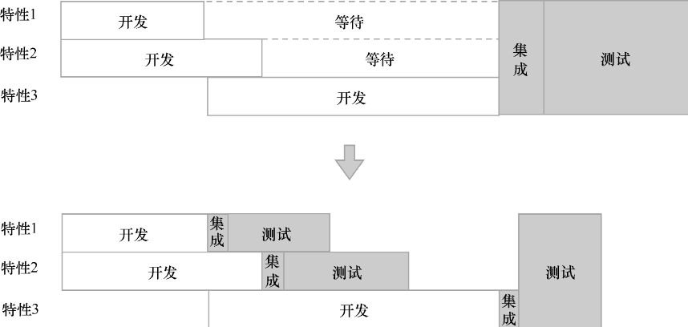

<!--
 * @Author: yao fanghao
 * @Date: 2023-11-13 15:21:18
 * @LastEditTime: 2023-11-15 11:52:49
 * @LastEditors: yao fanghao
-->
# 自学记录

2023.11.13-11.15

# 参考资料

* 持续交付2.0 乔梁
* 软件工程-实践者的研究方法 罗杰S普莱斯曼
* 大话软件工程-需求分析与软件设计
* 架构整洁之道
* 编程卓越之道-软件工程化
* DevOps入门与实践
* 设计模式
* 软件测试的艺术

## 概述

* 瀑布模型
* 敏捷开发
  * 迭代开发、增量开发
  * 涉及产品需求方、软开、软测
* DevOps
  * 统一软件开发和运维
  * 缩短开发周期，提高部署频率，更可靠发布
  * 涉及软开、软测、运维
* 持续交付2.0
  * 精益思想：需求拉动生产，避免浪费
  * 双环模型

## 双环模型

  

* **探索环**
  * 制订最小可行解决方案
  * 提问、锚定、共创、精炼
* **验证环**
  * 最快速度交付最小可行方案
  * 构建、运行、监测、决策
* 四个核心工作原则
  * 坚持少做
  * 持续分解问题
  * 坚持快速反馈
  * 持续改进并衡量

## 持续交付的软件系统架构

* 大系统小做
  * 系统拆分原则：高内聚、低耦合

* 常见的架构模式
    |  架构模式   | 特点  | 适用场景 |
    |  ----  | ----  | ---- |
    | 微核架构  | 插件通过核心框架进行通信，易发布、易测试等 | 客户端 |
    | **微服务架构**  | 将单一应用程序分为一组小服务，RESTful API，扩展性好、易部署、易开发 | 大型服务端系统  |
    | 分层的巨石应用  | 部署操作简单、快速迭代 | 创业公司或中小型项目 |

* 架构改造实施模式
  * 拆迁者模式
  * 绞杀者模式
  * 修缮者模式

## 业务需求协作管理

* 产品版本周期
  * 准备期、交付期

* 需求拆分的优点
  * 建立共识，协调工作
  * 小批量交付，加速价值流动
  * 低成本拥抱变化
  * 多次集成，及时反馈质量
  * 鼓舞团队士气

* 需求拆分的成本
  * 显式成本
  * 分批开发、测试和部署的迭代成本

* INVEST原则
  * 独立、可协商、有价值、可估算、规模小且适中、可验证

* 五大用户故事拆分法
  * 路径拆分法
  * 按接触点拆分
  * 按数据类型或格式拆分
  * 按规则拆分
  * 按探索路径拆分

* 需求分析与管理工具集
  * 用户故事地图
  * 用户故事树
  * 依赖关系图
  * 需求管理数字化平台

## 部署流水线

* 服务器\代理架构

* 初级部署流水线
  

* 流水线的设计原则
  * 一次构建，多次使用
  * 与业务逻辑松耦合
  * 并行化原则
  * 快速反馈优先
  * 重要反馈优先

* **部署流水线平台的构成**
    
  * 唯一受信源
    * 需求管理仓库、源代码仓库、制品库
  * 部署流水线平台
  * 四大基础支撑服务  
    * 编译构建管理服务
    * 自动化测试管理服务
    * 软件部署管理服务
    * 基础环境管理服务

## 版本控制

* 集中式、分布式
* 分支开发模式
  * 主干开发，主干发布
  * 主干开发，分支发布
  * 分支开发，主干发布

* GitHubFlow分支模式

* 版本发布模式
  * 项目制发布模式
  * 发布火车模式
  * 城际快线模式

## 持续集成

* 来源：极限编程
* 持续集成
  * 团队成员频繁提交，多次集成
  * 每次提交触发包含自动化验证集的构建任务

* **六步提交法**  
  
  * 检出最近成功的代码
  * 修改代码
  * 第一次个人构建
  * 第二次个人构建
  * 提交代码到团队主干
  * 提交构建

* 对持续集成最佳状态的自查表
  * 主干开发，频繁提交
  * 每次提交应该是一个完整的任务
  * 让提交构建在10分钟以内完成
  * 提交构建失败后应禁止团队成员提交新代码，也不许其他人检出该代码
  * 立即在10分钟内修复已失败的提交构建，否则回滚代码
  * 自动化构建验证通过后，对软件质量有比较大的信心

* 速度与质量的权衡
  * 分级构建
  * 多人同时提交的构建
  * 云平台

* **在团队中实施持续集成**
  
  * 构建脚本化，搭建持续集成框架
  * 添加已有的自动化验证集合
  * 选择利于持续集成的分支策略
  * 建立六步提交法
  * 持续优化
  * 个人技能持续提升

## 自动化测试

* 测试四象限
  

* 实施策略
  * 增加自动化测试用例的着手点
  * 提高自动化测试的执行次数
  * 良好自动化测试的特征
  * 共享自动化测试的维护职责
  * 代码测试覆盖率

* 用户验收自动化测试要点
  * 先搭建分层框架
    * 测试用例的描述层、实现层、接口层
  * 测试用例数应保持低位
  * 为自动化测试用例预留API
  * 为调试做好准备
  * 测试数据的准备

## 软件配置管理



* 原则
  * 一切皆有版本
  * 共享唯一受信源
    * 需求仓库、代码仓库、软件包仓库
  * 标准化与自动化

* 软件包的版本管理
  * 包管理的反模式
  * 集中式包管理服务
  * 软件包的元信息

* 环境基础设施管理
  * 以人脑+手工为代表的"蛮荒状态"
  * 以文档+私有脚本为代表的"规范化状态"
  * 以办公自动化为代表的"标准化状态"
  * 以受控式自动化脚本为代表的"自动化状态"

* 软件配置项的管理
  * 二进制与配置项
  * 配置信息的版本管理
  * 配置项的存储组织方式
  * 配置漂移与治理

* 不可变基础设施与云应用
  * 实现不可变基础设施
    * 物理机镜像、虚拟机镜像
    * Docker容器
  * 云原生应用

* 数据的版本管理

## 低风险发布

## 监测与决策

* 生产监测范围
  * 基础监测、应用监测、业务监测
  
* 数据监测体系
  
* 问题处理体系
  * 告警处理

* 测试左移
  
  
* 测试右移
  * 在生产环境运行
  * 混沌工程

## 大型互联网团队的FT化

《持续交付2.0》中14.3写得非常详细清楚，帮助很大

## 小团队逆袭之旅

《持续交付2.0》中15.3和15.4写得非常详细清楚，帮助很大

## 研发推动的DevOps

* 第一阶段：敏捷101
* 第二阶段：DevOps转型

---

# 扩展补充

## 敏捷开发 vs 传统瀑布模型

| 维度 | 瀑布模型 | 敏捷开发 |
|------|---------|---------|
| 需求 | 前期完整确定 | 迭代演进 |
| 开发周期 | 数月到数年 | 1-4周冲刺 |
| 交付 | 一次性交付 | 持续交付小版本 |
| 变更响应 | 困难、成本高 | 灵活、成本低 |
| 客户参与 | 需求阶段后少参与 | 全程紧密参与 |
| 测试 | 开发完成后集中测试 | 持续集成、持续测试 |
| 文档 | 大量文档 | 适度文档、可工作软件优先 |

## DevOps 工具链全景

| 阶段 | 常用工具 |
|------|---------|
| 代码管理 | Git、GitLab、GitHub、Bitbucket |
| 构建工具 | Maven、Gradle、Make、CMake |
| CI/CD | Jenkins、GitLab CI、GitHub Actions、CircleCI、ArgoCD |
| 代码质量 | SonarQube、ESLint、Checkstyle |
| 自动化测试 | Selenium、JUnit、pytest、Postman/Newman |
| 配置管理 | Ansible、Puppet、Chef、Terraform |
| 容器化 | Docker、Podman、containerd |
| 容器编排 | Kubernetes、Docker Swarm、Nomad |
| 监控告警 | Prometheus、Grafana、ELK Stack、Datadog |
| 制品仓库 | Harbor、Nexus、JFrog Artifactory |
| 消息队列 | Kafka、RabbitMQ、RocketMQ |

## 微服务架构设计要点

### 服务拆分原则

* **领域驱动设计（DDD）**：按业务领域拆分，每个服务对应一个限界上下文
* **单一职责**：每个服务只负责一个业务能力
* **无共享架构**：服务间通过 API 通信，不共享数据库
* **数据独立**：每个服务拥有自己的数据存储

### 微服务通信方式

| 方式 | 协议 | 特点 | 适用场景 |
|------|------|------|---------|
| RESTful API | HTTP/JSON | 简单、易调试 | 同步请求-响应 |
| gRPC | HTTP/2 + Protobuf | 高性能、强类型 | 内部服务间高频调用 |
| 消息队列 | AMQP/Kafka | 异步、削峰填谷 | 事件驱动、解耦 |
| GraphQL | HTTP | 客户端灵活查询 | 复杂数据聚合 |

### 微服务治理

* **服务发现**：Consul、Eureka、Nacos
* **负载均衡**：Ribbon、Nginx、Envoy
* **熔断降级**：Hystrix、Resilience4j、Sentinel
* **API 网关**：Kong、Spring Cloud Gateway、APISIX
* **链路追踪**：Jaeger、Zipkin、SkyWalking

## 容器化与 K8s 部署流水线

### 镜像构建流水线示例（GitHub Actions）

```yaml
name: Build and Deploy
on:
  push:
    branches: [main]
jobs:
  build:
    runs-on: ubuntu-latest
    steps:
      - uses: actions/checkout@v3
      - name: Login to Docker Hub
        run: docker login -u ${{ secrets.DOCKER_USER }} -p ${{ secrets.DOCKER_PASS }}
      - name: Build and push
        run: |
          docker build -t myapp:${{ github.sha }} .
          docker push myapp:${{ github.sha }}
      - name: Deploy to K8s
        run: |
          kubectl set image deployment/myapp myapp=myapp:${{ github.sha }}
```

### 蓝绿部署 vs 滚动更新 vs 金丝雀发布

| 策略 | 原理 | 优点 | 缺点 |
|------|------|------|------|
| **蓝绿部署** | 两套完整环境，切换流量 | 秒级回滚、环境隔离 | 资源消耗翻倍 |
| **滚动更新** | 逐步替换旧版本实例 | 资源消耗不变、平滑过渡 | 回滚慢、兼容性要求高 |
| **金丝雀发布** | 小比例流量跑新版本 | 风险最小、真实验证 | 需要流量治理能力 |

## 混沌工程

* 在生产环境引入故障来验证系统的韧性
* 核心原则
  * **稳态假设**：定义系统的"正常"行为指标
  * **控制变量**：控制爆炸半径，避免影响真实用户
  * **持续运行**：自动化、持续化实验

* 常见实验
  * 杀死 Pod（K8s Chaos Mesh）
  * 网络延迟/丢包（tc/netem）
  * CPU/内存压力（stress-ng）
  * 依赖服务超时/返回错误

* 工具：Chaos Mesh、Litmus、Gremlin

## 可观测性（Observability）

### 三大支柱

* **指标（Metrics）**
  * Prometheus + Grafana
  * RED 指标：Rate（速率）、Errors（错误）、Duration（耗时）
  * USE 指标：Utilization（利用率）、Saturation（饱和度）、Errors（错误）

* **日志（Logging）**
  * ELK Stack：Filebeat → Logstash → Elasticsearch → Kibana
  * Loki：轻量级日志聚合，与 Prometheus 集成

* **链路追踪（Tracing）**
  * OpenTelemetry：统一的数据采集标准
  * 采样策略：头部采样、尾部采样、概率采样

### SLI / SLO / SLA

* **SLI（服务级别指标）**：可用性、延迟、吞吐量、错误率
* **SLO（服务级别目标）**：99.9% 请求延迟 < 200ms
* **SLA（服务级别协议）**：对外承诺，通常附带赔偿条款

## 团队拓扑（Team Topologies）

* **流对齐团队**：直接面向业务价值流（一个产品/特性/服务）
* **赋能团队**：提供专业能力支持
* **复杂子系统团队**：维护高复杂度模块
* **平台团队**：提供自助服务平台能力

## 持续交付成熟度模型

| 等级 | 特征 |
|------|------|
| 0 - 手工 | 手动构建、测试、部署，周期长、易出错 |
| 1 - 自动化构建 | 脚本化构建，有版本控制 |
| 2 - 自动化测试 | 有单元测试和集成测试覆盖 |
| 3 - 自动化部署 | CI/CD 流水线，自动化部署到测试/生产环境 |
| 4 - 持续交付 | 任何版本都可一键部署到生产，全自动化 |
| 5 - 持续改进 | 基于数据持续优化流程和架构 |
